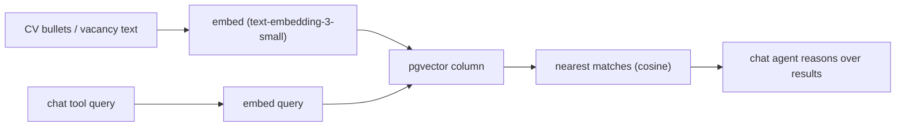

# CVere: RAG, Observability, and E2E Testing

Outline (non-detailed) plan for three skill-growth features. All respect the "chat is the only AI surface" rule in [AGENTS.md](AGENTS.md): retrieval is exposed as chat tools, not new AI endpoints.

## Recommended order

1. Playwright E2E — zero external cost, guards flows the RAG work will touch.
2. pgvector RAG — the headline skill.
3. Langfuse + eval — cheapest last; telemetry hook already exists.

## 1. pgvector RAG (highest priority)

Two connected features, both surfaced as chat tools:
- Vacancy to CV matching: rank which CV variant best fits a pasted vacancy, by meaning.
- Semantic search over CV content: retrieve the most relevant past bullets/projects when tailoring.

Outline:
- Migration: `create extension vector`; add `embedding vector(1536)` to `job_description` (see [supabase/migrations/20260509120000_cv_domain.sql](supabase/migrations/20260509120000_cv_domain.sql):270); new `cv_chunk` table (id, cv_id, user_id, kind, ref_id, content, embedding); HNSW index; owner-scoped RLS mirroring existing policies. Run `npm run generate-types`.
- Embedding infra: shared helper wrapping `@ai-sdk/openai` embeddings under `src/shared/api/ai/`; reuse existing `OPENAI_API_KEY`. Populate embeddings on CV/vacancy insert and update.
- Retrieval tools: `matchVacancyToCvs({jobDescriptionId})` and `searchCvContent({query})` added to the existing tool registry wired in [src/app/api/chat/route.ts](src/app/api/chat/route.ts):189 (a new `src/features/chat/tools/rag-tools.ts`, exported via the feature barrel). Read-only, owner-enforced, not in `MUTATING_TOOLS`.
- System prompt: teach the agent when to retrieve.

Resume line: "RAG with pgvector: semantic vacancy-to-CV matching and retrieval-augmented tailoring, exposed as agent tools."

## 2. LLM observability + eval

Observability outline:
- Add `instrumentation.ts` (Next.js) with a Langfuse `LangfuseSpanProcessor`, env-gated (`LANGFUSE_*`); no-op when unset.
- `experimental_telemetry` is already enabled on `streamText` with `userId`/`sessionId` metadata ([src/app/api/chat/route.ts](src/app/api/chat/route.ts):232), so no route changes beyond confirming metadata.

Eval outline:
- Add a runner under `scripts/eval/` with a small graded prompt set (asserts: never invents facts, emits valid tool calls, confirms before destructive actions).
- Use the existing `MockLanguageModelV3` seam in [src/shared/api/ai/chat-model.ts](src/shared/api/ai/chat-model.ts) for deterministic CI runs.

Resume line: "LLM observability (Langfuse) + eval harness for the chat agent."

## 3. Playwright E2E

Outline:
- Add Playwright + config + npm scripts (greenfield; none in [package.json](package.json) yet).
- Auth setup: test user / stored session for Supabase auth.
- First spec: login -> dashboard loads -> send a chat message -> assert streamed response + preview updates. Point chat at the mock model for determinism.
- Later: extend to CV edit + library flows; optional CI wiring.

Resume line: "End-to-end tests (Playwright) covering the core authenticated flow."

## Notes / decisions still open

- Embeddings reuse `OPENAI_API_KEY` (`text-embedding-3-small`, negligible cost) vs a local model — plan assumes OpenAI reuse.
- RAG v1 depth: both matching + search, or matching only — plan assumes both; can trim to matching-only for a leaner first cut.