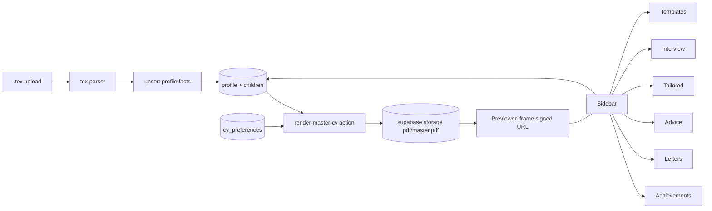

# CV Previewer

## Branch
- Create `feature/previewer` off `main` before any edits.

## Decisions confirmed
- Master CV is rendered directly from `profile` + children. Optionally pinned to a `tailored_cv` to override.
- Import accepts `.tex` only, in the Examples format (root file + `elements/*.tex`), via multi-file or `.zip` upload. Deterministic parser, no LLM.
- Two templates: `single-column` (accent `#0066CC`) and `two-column` (accent `#007066`), both with user-overridable accent.
- PDF is server-rendered with `@react-pdf/renderer` and shown in an `<iframe>` via a signed URL. Re-render is triggered on save/template change (no live keystroke preview). Trade-off: simpler, no bundle bloat; cost is ~1s refresh latency on edits.

## Architecture overview



## Schema

New migration: `supabase/migrations/<ts>_previewer.sql`
- `cv_preferences` (1 row per user):
  - `id`, `user_id` unique fk auth.users, `template` text check in `('single-column','two-column')`, `accent_hex` text default `'#0066CC'`, `pinned_tailored_cv_id` uuid null fk `tailored_cv` on delete set null, `master_pdf_path` text null, `updated_at`.
  - RLS: owner-only, same pattern as existing tables.
- Auto-create row in `handle_new_user_profile()` (extend the trigger).
- Run `npm run migration:up` to regenerate `src/libs/supabase/types.ts`.

## Templates and renderer

Refactor [src/pdf/Cv.tsx](src/pdf/Cv.tsx) and [src/pdf/theme.ts](src/pdf/theme.ts):
- Split into `src/pdf/templates/single-column.tsx` and `src/pdf/templates/two-column.tsx`. The current `Cv` becomes the single-column template.
- Two-column template uses `react-pdf` `View` with `flexDirection: 'row'`, mirroring the Examples 2-column layout: left column = summary, skills, projects, certifications, languages; right column = experience, education.
- `pdfTheme` accepts `accent` from caller; replace the hard-coded `#1f4d8a`. Section title style becomes a function of theme.
- Add `src/pdf/render-master-cv.tsx` that takes `profile + children + identity + template + accent` and returns a `Document`.
- Keep `src/pdf/CoverLetter.tsx` unchanged; it can pick up accent from the same theme.

New action: `src/features/previewer/actions/render-master-cv.ts`
- `authActionClient`, no input.
- Loads profile + children via existing controllers.
- Loads `cv_preferences`; defaults to `single-column` + default accent if missing.
- Calls `renderToBuffer` and uploads to `pdf/{userId}/master.pdf` (upsert).
- Writes back `master_pdf_path` to `cv_preferences`.
- `revalidatePath('/')`.

New action: `src/features/previewer/actions/update-cv-preferences.ts`
- Zod-validated `template` and `accent_hex` (`/^#[0-9a-fA-F]{6}$/`), and optional `pinned_tailored_cv_id`.
- Upserts row, then invokes `renderMasterCv`.

## Previewer page (the new main screen)

Move `/dashboard` content out of the way (keep route but unlink) and make `/` (or `/dashboard`) the previewer. Decision: keep `/dashboard` as the previewer route and update `AppNav` so it's the first/default. Redirect `/` -> `/dashboard` for logged-in users.

`src/app/(app)/dashboard/page.tsx` becomes:
- Server component. Loads `cv_preferences`. If `master_pdf_path` is null, calls `renderMasterCv` once. Creates a signed URL via `createSignedDownload`-style helper.
- Layout:

```tsx
<div className='grid grid-cols-[1fr_360px] gap-4 h-[calc(100vh-...)]'>
  <PreviewerPane signedUrl={url} pinned={pinned} />
  <PreviewerSidebar profile={...} counts={...} prefs={prefs} />
</div>
```

- `PreviewerPane` is a client component: full-height `<iframe src={signedUrl}>`, with toolbar buttons (Refresh preview, Pin tailored variant, Open full-screen).
- `PreviewerSidebar` is a client component using shadcn `Tabs` or an accordion. Sections:
  - Templates: radio for `single-column` / `two-column`, color input for accent. On change -> `updateCvPreferences` -> server action re-renders -> iframe key bumps.
  - Quick add achievement: minimal form reusing `addAchievement` action.
  - Cover letters: list recent + "Generate from job" button linking to `/letters`.
  - Tailored CVs: list recent + Pin/Unpin actions + link to `/tailored`.
  - Advice: open count + link.
  - Interview: link.
  - Profile: link to `/profile`.
  - Import CV: upload control (see below).

Existing dashboard cards content moves to a small "stats" strip above the previewer or is removed; recommend removing to keep the screen focused. Counts used by the sidebar reuse the same controllers.

Update [src/app/(app)/_components/app-nav.tsx](src/app/(app)/_components/app-nav.tsx) to reorder: `Previewer` first, then existing entries. Drop `Dashboard` label in favor of `Previewer`.

## .tex import

New module `src/features/previewer/import/tex-parser.ts` (pure functions, no I/O):
- Input: `Map<string, string>` of file path -> contents (root `.tex` + every `elements/*.tex`).
- Strategy: regex-driven, tolerant of whitespace and comments.
- Header parse from root `.tex` (between `\begin{center}` and `\end{center}`):
  - Name: `{\Huge \textbf{(.+?)}}` -> `users.full_name` is read-only here; we store as identity override on `cv_preferences` only if needed (skip for v1; we already use `auth.users.user_metadata.full_name`).
  - Contacts: `\href{mailto:(.+?)}`, `\faPhone~(.+)`, `\faMapMarker\*~(.+?)\s*\\quad`, `\faLinkedin~\href{(.+?)}`. Currently the schema has no contact table; persist parsed contacts into `profile.summary` is wrong. Decision: skip contacts in v1 and surface a "[MISSING]" warning in the import report. Add a contacts schema later.
- Section parsers, one per `elements/*.tex`:
  - `summary.tex` -> first paragraph after `\section{...}` -> `profile.summary`.
  - `experience.tex` -> repeated blocks. Heuristic: each entry begins with `\textbf{<role>} \hfill <date range>` then `\textit{<company>} \hfill <location>` then `\begin{itemize} \item ... \end{itemize}`. Map to `experience` rows.
  - `projects.tex` -> `\textbf{<name>}` + bullets -> `project` rows.
  - `skills.tex` -> `\textbf{<category>:} a, b, c` lines -> `skill` rows with `category`.
  - `education.tex` -> `\textbf{<institution>}`, `\textit{<degree, field>} \hfill <dates>` -> `education` rows.
  - `certs.tex` -> `\textbf{<name>}, <issuer>, <date>` -> `certification` rows.
  - `lang.tex` -> `<name> (<proficiency>)` -> `language` rows. Map free-text proficiency to enum via lookup table (`A1->beginner`, `B1->intermediate`, ...). Unknown -> `null` and add warning.
- Output type:

```ts
type TexImportResult = {
  summary: string | null;
  experience: ExperienceInput[];
  projects: ProjectInput[];
  skills: SkillInput[];
  education: EducationInput[];
  certifications: CertificationInput[];
  languages: LanguageInput[];
  warnings: string[]; // items we couldn't parse
};
```

Server action `src/features/previewer/actions/import-tex.ts`:
- Input schema accepts an array of `{ name, content }` strings. Optional `mode: 'replace' | 'append'` (default `append`).
- Calls parser, then for each non-empty section either deletes existing rows (replace) or appends, using the existing profile-write paths in [src/features/profile/actions/update-profile-section.ts](src/features/profile/actions/update-profile-section.ts) where possible (or direct supabase inserts for batch).
- Returns `{ ok, counts, warnings }`. Sidebar shows a sonner toast with summary.

Client uploader (`PreviewerSidebar` -> Import section):
- `<input type="file" multiple accept=".tex,.zip">`. If `.zip`, unzip in browser using `jszip` (add dep) and forward `{name, content}[]` to the action.
- Show a confirm dialog when `mode='replace'` is chosen.

## Files to create
- `supabase/migrations/<ts>_previewer.sql`
- `src/pdf/templates/single-column.tsx`, `src/pdf/templates/two-column.tsx`, `src/pdf/render-master-cv.tsx`
- `src/features/previewer/actions/render-master-cv.ts`
- `src/features/previewer/actions/update-cv-preferences.ts`
- `src/features/previewer/actions/import-tex.ts`
- `src/features/previewer/import/tex-parser.ts`
- `src/features/previewer/controllers/get-cv-preferences.ts`
- `src/features/previewer/components/previewer-pane.tsx`
- `src/features/previewer/components/previewer-sidebar.tsx`
- `src/features/previewer/components/template-picker.tsx`
- `src/features/previewer/components/import-tex-form.tsx`

## Files to change
- [src/pdf/Cv.tsx](src/pdf/Cv.tsx), [src/pdf/theme.ts](src/pdf/theme.ts) - factor template + theme accent.
- [src/app/(app)/dashboard/page.tsx](src/app/(app)/dashboard/page.tsx) - replace with previewer.
- [src/app/(app)/_components/app-nav.tsx](src/app/(app)/_components/app-nav.tsx) - rename and reorder.
- [src/app/page.tsx](src/app/page.tsx) - logged-in users redirect to `/dashboard`.
- [src/features/exports/actions/export-pdf.tsx](src/features/exports/actions/export-pdf.tsx) - read `accent_hex` and `template` from prefs when rendering tailored CVs (so exports match the chosen style).

## Out of scope (v1)
- Contact details schema (parser warns and drops them).
- Live keystroke preview (re-renders on save only).
- LaTeX export (we render via `@react-pdf`, not LaTeX).
- Importing PDFs.

## Verification
- `npm run lint` and `npm run build` must pass.
- Manual: create user, import `Examples/1-column.tex` (with synthetic `elements/*.tex` produced from your real files), confirm sections populate, switch template to two-column, change accent, confirm preview re-renders.
