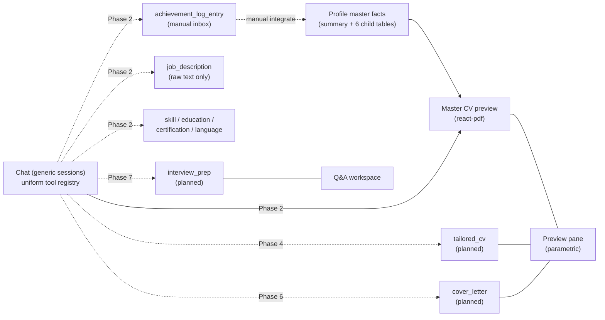

## Recommendation in one line

Land visible streaming + visible tool calls first (Phase 1) so every later phase is debuggable. Then deepen master-CV chat tools, then multi-session as generic threads, then re-introduce tailored CVs / cover letters / interview as chat-mutable artefacts (one at a time), with the dashboard restructured to fit them. PDFs to Azure Blob stays last.

## Design constraints

### Chat is still the only AI surface

The Remove-non-chat-AI cut was deliberate. When tailored CVs, cover letters, and interview prep come back, they come back as **chat tools backed by their own tables**, not as new AI server actions or new `/api/*` AI endpoints:

- No `tailorCv(jobDescriptionId)` safe-action. Creation is a chat tool `createTailoredCv` invoked inside a chat session.
- No `generateCoverLetter(jobDescriptionId)` safe-action. Same pattern.
- No `extractJobDescription` AI. Vacancies remain raw text; chat reads them via a `readVacancy` tool.
- Manual CRUD around the artefacts (list, view, rename, delete) is fine as routes + safe-actions.

### Sessions are generic threads, not surface-bound

A `chat_session` row is just a named conversation. It does **not** pin to one artefact. Concretely:

- No `surface_kind` / `surface_ref_id` columns on `chat_session`. Just `(id, user_id, title, created_at, updated_at, last_message_at)`.
- Every chat tool is registered on every session. There is no per-surface tool gating in the route.
- The model figures out what the session is for from the conversation history, the user's intent in their latest message, and one lightweight context hint the client sends with each request (see below).
- A single session can edit the master CV, spin up a tailored variant, and draft a cover letter for the same vacancy — all in one thread — if the user wants.

This keeps the architecture explanation simple ("one AI endpoint, one tool registry, many artefact tables") and means new artefacts cost a table + a tool group + a view, not new routing logic.

### Current-context hint

To avoid the model having to ask "which CV?" on every follow-up, the client sends a small `context` object alongside each `POST /api/chat` request:

```ts
type ChatContext = {
  previewing: { kind: 'master' | 'tailored_cv' | 'cover_letter'; refId: string } | null;
  workspace: { kind: 'interview'; refId: string } | null;
  recentVacancyId?: string;
};
```

The route appends a synthetic system message ("The user is currently looking at tailored CV X") so the model defaults to the right artefact when the user says "rewrite the summary". The model can always override by calling the explicit list/read tools when the user is clearly talking about something else.

## What changed since the previous roadmap

The Remove-non-chat-AI cut deleted `tailored`, `letters`, `advice`, `interview`, the cover-letter PDF, the `extracted`/`diff` job-description AI, the old multi-file stub provider module set under `src/libs/ai/` (`stub.ts`, `provider.ts`, `openai.ts`, `types.ts`, `index.ts`), and `pinned_tailored_cv_id`. Achievements insert with `null normalized_text/target_section` and integrate manually; vacancies are raw text + delete. See `AGENTS.md` for the current shape.

The user has confirmed:

- Visible streaming + visible tool calls land **before** more chat tools, so the new functionality is debuggable as it ships.
- Multi-session is going in (not optional).
- Tailored CVs, cover letters, and interview prep will come back, but only via chat tools.
- "Advice" is intentionally not coming back; the equivalent value is conversational review inside any chat session.
- The product needs a CV library view (pick which CV to open) and a tailored-CV view (preview + chat for that variant).
- Sessions are **generic threads**, not per-artefact. The chat reasons about purpose from conversation context plus a current-context hint, not from a fixed surface column.
- Handoffs from other surfaces land in the **current** session by default and prefill the input rather than auto-sending; the user controls whether to start a fresh chat or keep going in the same thread.

Implications:

- Phase 0 stays done.
- New Phase 1 covers visible streaming + visible tool calls; the items moved out of the old "Chat UX polish" phase.
- Old Phase 1 (deepen master tools) shifts to Phase 2; everything below shifts by one. New Phase 8 (Chat UX polish) keeps only the items that did not move up.
- Multi-session is Phase 3 — schema is minimal (no surface columns), tool registration is uniform across sessions.
- Phase 4 (Tailored CV), Phase 6 (Cover letter), Phase 7 (Interview) each cost one table + one chat-tool group + one view.
- Layout (Phase 5) ships between Tailored and Cover letter so it proves itself against ≥1 non-master artefact before the next one lands.

## Why this order

- Phase 1 (visible streaming + tool cards) is the cheapest leverage win: it makes every later phase observable to the user. Building Phase 2's new tools blind to what the model is doing would be a regression in user trust. Also: the AI SDK already exposes the parts; this is pure rendering work, no schema, no provider change.
- Master-CV depth (Phase 2) is independent of multi-session and serves as the pattern for every later artefact's mutation tools. With Phase 1 in place, the new tools are observable from day one.
- Multi-session (Phase 3) is mandatory before any non-master artefact — users need to keep multiple parallel conversations alive (one per vacancy they're chasing, typically) and the singleton thread won't scale to that.
- Tailored CV (Phase 4) is the most-asked artefact and the most pattern-defining: it forces decisions about per-artefact PDF caching, library view shape, and how the current-context hint flows from the preview pane into the chat request.
- Layout (Phase 5) ships after Tailored so the session list, CV library, and current-context hint are validated against a real second artefact kind before Cover letter and Interview pile on.
- Cover letter (Phase 6) and Interview (Phase 7) reuse the Phase 4 + Phase 5 patterns. Interview is later because it has no PDF and is the most experimental.
- Phases 8–10 carry over their previous purpose.

## What I would defer indefinitely

Surface only if a trigger fires:

- A persisted "advice" artefact. The previous build had it; conversational review inside any session covers the same ground without a new table.
- Per-tier subscription gating. Single env flag is enough.
- Multi-language CV output until quality is proven on non-English content.
- Moving `chat_message.parts` to Azure Blob — no row-bloat trigger.

## Current state map



## Phase dependencies

| Phase | Depends on | Unblocks |
|---|---|---|
| 0 | — | (done) |
| 1 | 0 | every later phase (observability of chat behaviour) |
| 2 | 1 | 4, 6 (mutation-tool patterns) |
| 3 | 1 | 4, 5 |
| 4 | 2, 3 | 5 (real second artefact), 6 (artefact pattern) |
| 5 | 3 (and ≥1 artefact from 4) | 8 |
| 6 | 3, 4 | — |
| 7 | 3 | — |
| 8 | 5 | polish gate for 9 |
| 9 | 2, 4/6/7 (relevant artefact) | — |
| 10 | none (decoupled) | — |
| Polish track | runs in parallel from phase 0 onward | each phase's polish gate |
| Observability | none | — |

## Roadmap

### Phase 0 — Pre-work (DONE)

Outcome:

- Stub provider module set deleted; only `src/libs/ai/chat-model.ts` remains in that folder. `getChatModel()` returns OpenAI directly via `@ai-sdk/openai` when `OPENAI_API_KEY` + `OPENAI_CHAT_MODEL` are set. The in-file `MockLanguageModelV3` branch is an allowed dev/test fallback for missing env vars outside production; production throws `ChatModelNotConfiguredError`. `OPENAI_API_KEY` is documented in README.
- Subscription gate landed as `CHAT_REQUIRE_SUBSCRIPTION` env flag (default `false`) in `src/app/api/chat/route.ts`; no dead commented block.
- Langfuse intentionally skipped (see Observability).

### Phase 1 — Visible streaming + visible tool calls (DONE)

Goal: the chat panel feels like Claude / OpenAI / Cursor. Text streams in smoothly with a blinking caret while a response is in flight; every tool call renders as a card showing the tool name, the arguments the model passed, and the output it received, with collapse/expand on demand. No new tools, no schema changes — pure UX work over the existing AI SDK parts.

Current state (verified):

- `src/features/chat/components/chat-panel.tsx` uses `useChat` from `@ai-sdk/react` v6. `messages` already updates reactively as parts stream in, and `status` exposes `submitted | streaming | ready | error`.
- `src/features/chat/components/chat-message.tsx` renders text parts as a static `<p>` with no caret. Tool parts render as a single-row label + status badge — input arguments and output text are dropped on the floor. Reasoning parts render as italic text with no collapse.
- Tool part shape from AI SDK v6: `{ type: 'tool-<name>', toolCallId, state, input?, output?, errorText? }` (and `'dynamic-tool'` with an explicit `toolName`). `state` walks `input-streaming → input-available → output-available | output-error | approval-requested`.

Server side — smooth streaming:

- In `src/app/api/chat/route.ts`, add `experimental_transform: smoothStream({ delayInMs: 25, chunking: 'word' })` to the `streamText` call. `smoothStream` is exported from `ai` v6; it splits raw token deltas into smaller paced chunks so the client sees a steady stream instead of bursty deltas. Match the cadence to feel natural; tune after first try.
- Keep `stepCountIs(8)` and the existing `onStepFinish` / `onFinish` hooks.

Client side — text rendering:

- New `StreamingText` component in `src/features/chat/components/streaming-text.tsx`. Renders `part.text` with `whitespace-pre-wrap`, plus a pseudo-element caret (`▍` or `|`) animated via CSS keyframes when the message is the **last assistant message** AND `status === 'streaming'` AND this is the **last text part** in that message. Cursor disappears as soon as the next part arrives or the stream completes.
- Caret animation: a 1s blink (`@keyframes blink-caret`) lives in `src/styles/globals.css` or, preferably, a `tw-animate-css` utility. Keep it subtle — opacity 1 → 0.2 → 1, not full opacity 0.
- Chunked fade-in (optional, gated behind a feature flag while we tune): wrap each new run of characters in a `<span>` with a 120ms `opacity 0 → 1` transition. This is the Cursor-style "incoming words materialise" feel. Skip if it fights React reconciliation; smooth stream alone is usually enough.
- Auto-scroll: keep the current "scroll to bottom on `messages` / `status` change" but disable it if the user has scrolled up by more than ~80px (stash `scrollHeight - scrollTop` on each scroll event; only auto-scroll when within the threshold). Prevents fighting the user when they re-read earlier messages mid-stream.

Client side — tool-call cards:

- New `ToolCallCard` component in `src/features/chat/components/tool-call-card.tsx`. Replaces the inline badge in `chat-message.tsx`. Layout:
  - Header row: tool icon (lucide, e.g. `Wrench`), humanised tool name, status badge (Working / Done / Error / Awaiting approval), chevron toggle. Header is clickable to expand/collapse.
  - Expanded body: two sections.
    - **Input** — labelled `Arguments`. Renders `part.input` as a compact key/value list for short objects (≤4 fields, all primitive values) and as a syntax-highlighted JSON block (prism-style or just `<pre>` with our existing mono font) otherwise. Show "Streaming…" with a skeleton while `state === 'input-streaming'`.
    - **Output** — labelled `Result`. Renders `part.output`. Most existing tools return a one-line string ("Edited experience bullet 3.") — show inline. `readProfile` returns the structured snapshot — render as a collapsed JSON block with a "Show / Hide" toggle. For errors, render `errorText` in destructive style.
- Default expansion rules:
  - Collapsed by default for `state === 'output-available'` with a small one-line summary visible next to the chevron (first sentence of the output, or first arg if output empty).
  - Auto-expanded while `state ∈ {input-streaming, input-available}` so the user can see what the model is asking for in real time. Collapses when the output arrives, unless the user opened it manually (track per-toolCallId open state in component state).
  - Always-expanded on error.
- Re-run button (post-MVP for this phase): hide behind a feature flag; revisit in Phase 8 when retry/edit lands.

Reasoning visibility:

- Wrap existing italic reasoning text in a collapsed-by-default disclosure ("Reasoning ▾"). Same component as the tool card body, no JSON. Useful when the model is thinking through a tough edit.

Persistence:

- AI SDK v6 already persists tool parts (with input + output) in `chat_message.parts`. Reload restores the cards in their final state. No store changes required.

Files touched:

- `src/app/api/chat/route.ts` (1 line: add `experimental_transform`).
- `src/features/chat/components/chat-message.tsx` (rewire tool rendering through `ToolCallCard`, wrap text in `StreamingText`).
- `src/features/chat/components/chat-panel.tsx` (pass `isStreamingLastAssistant` down to messages so `StreamingText` can decide whether to show the caret; tighten the auto-scroll behaviour).
- New: `src/features/chat/components/streaming-text.tsx`.
- New: `src/features/chat/components/tool-call-card.tsx`.
- `src/styles/globals.css` (caret keyframe if not using `tw-animate-css`).

Polish gate (Done when):

- A long assistant response visibly streams in word by word, with a blinking caret that disappears when the next part starts.
- Every tool call is visible as a card. Calls in progress are auto-expanded and show the model's input as it streams. Completed calls collapse to a one-liner; click expands to show the structured input/output.
- Errors render with the failure text inline.
- Reload mid-turn restores both the partial text (via the existing resumable-stream path) and the tool-card state.
- Scrolling up to re-read does not get yanked back to the bottom by streaming updates.

Handoff notes:

- **Server**: `src/app/api/chat/route.ts` now imports `smoothStream` from `ai` v6 and passes `experimental_transform: smoothStream({ delayInMs: 25, chunking: 'word' })` to `streamText`. Word-level chunking gives ~40 words/sec; tune the delay later if it feels off. Persistence, tool wiring, and the `data-preview-dirty` part are unchanged.
- **`src/features/chat/components/streaming-text.tsx` (new)**: pure-presentational. Renders a text part with `whitespace-pre-wrap` and an inline blinking-caret span (`animate-caret-blink`, already shipped by `tw-animate-css`). Caret visibility is decided by the parent — the component never tries to know about stream status itself.
- **`src/features/chat/components/tool-call-card.tsx` (new)**: replaces the old single-row badge. Header (icon + humanised name + summary + status badge + chevron) is a `<button aria-expanded>`; body shows `Arguments` and `Result`/`Error`. Auto-open rule lives in `shouldAutoOpen(state)`: open while `input-streaming`/`input-available`/`output-error`, collapsed once `output-available`. User clicks lock the open state via `useState<boolean | null>`. Payload renderer has two modes: a key/value `<dl>` for plain objects with ≤ 4 primitive fields, otherwise a `<pre>` JSON block (max-height 18rem, scrollable). `ToolPartState` is exported here and shared with the message component.
- **`src/features/chat/components/chat-message.tsx`**: rewritten. Text parts now go through `StreamingText`; tool parts (both `tool-*` and `dynamic-tool`) through `ToolCallCard`. Reasoning parts render through a new local `ReasoningDisclosure` component (collapsed by default, same chevron pattern as the tool card). `data-preview-dirty` parts still return `null`. New prop `isStreamingLastAssistant` is used to compute `lastTextPartIndex` so the caret only trails the very last text part of a streaming assistant message.
- **`src/features/chat/components/chat-panel.tsx`**: passes `isStreamingLastAssistant={status === 'streaming' && index === lastAssistantIndex}` to `ChatMessage`. The auto-scroll effect now finds the base-ui scroll viewport via `closest('[data-slot="scroll-area-viewport"]')` (the previous version wrote to a non-scrolling inner div, which was a no-op) and gates auto-scroll on `stickToBottomRef.current`, which is updated by a passive `scroll` listener that compares `scrollHeight - scrollTop - clientHeight` against `STICKY_BOTTOM_THRESHOLD_PX` (80 px). Scrolling more than 80 px above the bottom suspends auto-scroll until the user returns.
- **`src/styles/globals.css`**: not touched — `tw-animate-css` already exposes the `animate-caret-blink` utility, so a new keyframe was unnecessary.
- **Persistence**: unchanged. AI SDK v6 already round-trips tool `input`/`output`/`errorText` inside `chat_message.parts`, so reload restores the cards in their final state without store changes.
- **Deferred to Phase 8 per the original plan**: per-tool-call re-run button (still no UI surface), retry/edit on last assistant/user message, the "chunked fade-in" effect (`smoothStream` alone reads well enough). The original plan called for a `data-preview-dirty` carrying `{kind, refId}` — that's a Phase 4 change, not Phase 1, so the side-channel still uses the legacy `{ renderedAt }` shape.
- **Verification**: `npm run lint` clean; `npm run build` clean (Next 16.2.6, Turbopack, TypeScript pass). Manual smoke test of the streaming UX requires `OPENAI_API_KEY` + `OPENAI_CHAT_MODEL` in `.env.local`.

### Phase 2 — Deepen master-CV chat tools (DONE)

Goal: the user can do every realistic master-CV edit by talking to the agent, including the things currently bouncing them to manual forms. With Phase 1 in place, every new tool ships with its arguments and outputs visible from day one.

Current tool surface (`src/features/chat/tools/content-tools.ts` + `style-tools.ts`): `readProfile`, `rewriteSummary`, add/edit/remove experience and project bullets, plus `setTemplate`, `setAccentHex`, `setEducationDateFormat`, `setCertificationDateFormat`.

Order by leverage:

1. **Missing-section CRUD.** Mirror the bullet pattern for `skill`, `education`, `certification`, `language`. Each needs `add{Section}`, `edit{Section}`, `remove{Section}` and `move{Section}` for reordering. Persistence already exists in `src/features/profile/actions/update-profile-section.ts` — wrap, don't duplicate. Update `aiProfileSchema` in `src/features/chat/profile-snapshot.ts` so `readProfile` exposes the UUIDs.
2. **Experience / project entry lifecycle.** `addExperience`, `removeExperience`, `moveExperience` + project equivalents. Today the chat can edit bullets but cannot create or delete the parent entry.
3. **Identity / contact fields.** `setFullName`, `setLocation`, `setContactEmail`, `setLinks`. The system prompt currently forbids these ("Do not change identity-level fields"); lift the restriction once the tools exist. Strict server-side validation (URL parsing, email regex).
4. **Achievement integration tools.** `listPendingAchievements`, `integrateAchievement({id, targetSection})`, `dismissAchievement`. Reuse `profile-content-service` mutators plus the section-specific inserts in `src/features/achievements/actions/achievement-actions.ts`. Require an explicit user confirmation in chat before `integrateAchievement` runs.
5. **Vacancy-aware editing.** `listVacancies`, `readVacancy({id})`. No persisted tailored artefact yet — the chat reads the raw text and proposes edits on the master CV. This is the bridge to Phase 4; once Tailored ships, the model will switch to `createTailoredCv` instead of editing master in place.

Guardrails:

- Keep `MUTATING_TOOLS` flat in `content-tools.ts`. It stays flat through Phase 3 and beyond — sessions are generic and every tool registers everywhere.
- Per-entry caps comparable to existing 50-bullet cap on skills/education/cert/lang.
- Every new mutator returns a one-line human-readable string. (The tool-card body from Phase 1 will render arguments structured; the return value just goes in the result section.)

Done when: the user can land in the dashboard, say "rebuild my CV for an SRE role at $company using this vacancy I just pasted", and the chat reads the vacancy, edits summary + relevant bullets + skills + ordering, and re-renders the PDF — all without the manual editor, with every tool call visible.

Handoff notes:

- **`src/features/chat/services/profile-content-service.ts`**: extended with section CRUD (`add/edit/remove/move` for skill, education, certification, language), entry lifecycle (`add/edit/remove/move` for experience and project), bullet reorder (`moveExperienceBullet`, `moveProjectBullet`), and `updateProfileIdentity` (single patch for full_name / location / phone / contact_email / linkedin_url / github_url / website_url). All routes go through `getOrCreateProfile` for the profile_id, validate ownership via `user_id`, trim strings, and coerce empty strings to `null` via the shared `normaliseNullableString` helper. New `MAX_SECTION_ROWS = 50` cap matches the existing 50-bullet cap; the new `assertCapAndNextPosition(user, table)` helper centralises the cap check + auto-positioning (max + 1). Move ops fan out one UPDATE per row that needs renumbering — bounded at 50 by the cap.
- **`src/features/achievements/services/achievement-service.ts` (new)**: extracted `integrateAchievementById`, `dismissAchievementById`, and `listPendingAchievementRows` so both the `/achievements` safe-action and the chat tools share one implementation. The placeholder `[MISSING] company` / `[MISSING] institution` strings survive on the `experience` and `education` inserts (polish-track copy fix, not a Phase 2 change). The safe-action (`achievement-actions.ts`) keeps the `revalidatePath('/achievements' | '/profile' | '/dashboard')` triggers; the chat tool path relies on the route's end-of-turn PDF render plus normal RSC refetches.
- **`src/features/chat/schemas.ts`**: added zod input schemas for every new tool. Identity / contact schemas use the trimmed-string + nullable-clear convention. Email and URL fields use `z.email()` / `z.url()` (zod v4 top-level helpers). `setLinksInputSchema` uses a `.refine()` to require at least one of the three link fields. The `optionalShortText`, `isoDateSchema`, and `stackSchema` helpers are local to the section/entry block; everything carries `.describe()` metadata so the model gets a clean JSON Schema.
- **New tool modules** (each is a separate file so PRs around a single domain stay small; all of them register flat on the route alongside the existing groups):
  - `src/features/chat/tools/section-tools.ts` — 16 tools (4 ops × 4 sections).
  - `src/features/chat/tools/entry-tools.ts` — 10 tools (add/edit/remove/move + moveBullet × 2). `editExperience` / `editProject` cover parent-entry fields (company, role, dates, etc.); bullets stay on the dedicated bullet tools.
  - `src/features/chat/tools/identity-tools.ts` — `setFullName`, `setLocation`, `setPhone`, `setContactEmail`, `setLinks` (last accepts any subset of linkedinUrl / githubUrl / websiteUrl).
  - `src/features/chat/tools/achievement-tools.ts` — `listPendingAchievements`, `integrateAchievement`, `dismissAchievement`. `previewText` truncates the inbox row to 240 chars so the snapshot stays small.
  - `src/features/chat/tools/vacancy-tools.ts` — `listVacancies`, `readVacancy`. Read-only; the chat reads raw text and edits master in place until tailored CVs ship in Phase 4. `readVacancy` clamps text at 20k chars (same as the ingest cap).
- **`src/features/chat/tools/content-tools.ts`**: `MUTATING_TOOLS` set is now the central registry for every mutating tool name across all tool modules (per the plan's "flat" guardrail). `integrateAchievement` is included (it inserts into experience / project / etc.); `listPendingAchievements`, `listVacancies`, `readVacancy`, and `dismissAchievement` are excluded (the latter doesn't change anything that affects the rendered PDF).
- **`src/app/api/chat/route.ts`**: spreads the five new tool builders into the existing `tools` object alongside `buildStyleTools` and `buildContentTools`. Tool gating logic in `onStepFinish` is unchanged — it still checks `MUTATING_TOOLS.has(toolName)` to flip the `dirty` flag for the end-of-turn render.
- **`src/features/chat/system-prompt.ts`**: rewritten. Lifted the "Do not change identity-level fields" restriction now that identity tools exist. Added a tool-groups index, the per-tool confirmation rule (`integrateAchievement` needs explicit user agreement on both achievement and target section, `remove*` tools need confirmation), and the vacancy-aware-editing instruction telling the model to invent nothing beyond what's in the profile.
- **`src/features/chat/components/tool-call-card.tsx`**: `TOOL_LABELS` extended with humanised labels for every new tool name (grouped by domain). Auto-humanise still covers anything we forget. No behavioural changes.
- **`src/features/achievements/actions/achievement-actions.ts`**: refactored to call the new service. Behaviour and revalidation paths are unchanged.
- **Verification**: `npm run lint` clean; `npm run build` clean (Next 16.2.6, Turbopack, TypeScript pass). End-to-end tool exercise requires a live OpenAI key — no automated test added.
- **Deferred to later phases (not regressions)**:
  - `stepCountIs(8)` in the route is unchanged. A long tailoring turn (readProfile + readVacancy + many edits) may hit the cap; if that happens before Phase 4, bump conservatively to 16. Left alone for now to avoid silent runtime cost growth.
  - The "[MISSING] company" / "[MISSING] institution" placeholders on achievement integration into experience / education are still in the service — flagged as a polish-track copy fix.
  - Per-tool re-run UI (Phase 8) and undo on destructive tools (Phase 9) still deferred; the system prompt's confirmation rule is the only safety net for the new `remove*` tools.

### Phase 3 — Multi-session chat (generic threads)

Goal: chat becomes session-scoped. Required infrastructure for every artefact that follows. Sessions are general-purpose threads; the model decides what each one is for from conversation context and the current-context hint.

Schema:

- New table `chat_session(id uuid pk, user_id uuid, title text, created_at timestamptz, updated_at timestamptz, last_message_at timestamptz)` with RLS by `user_id = auth.uid()`. **No** `surface_kind`, **no** `surface_ref_id` — sessions are not tied to a specific artefact.
- Add `session_id uuid null references chat_session(id) on delete cascade` to `chat_message`. Migration order: add nullable column → backfill one session per user (`title = 'General'`) → set `NOT NULL` in a follow-up migration once writes are clean. Add index `chat_message(session_id, created_at)` and drop the existing `(user_id, created_at)` index once unused.
- `title` is initially auto-suggested by the model from the first user message (cheap: a one-shot `generateText` call inside the route on first turn, fire-and-forget update to the row). User can rename.

Store + route:

- Rework `src/features/chat/storage/chat-message-store.ts` from `(userId)` to `(sessionId)`. Session CRUD (`listSessions`, `createSession`, `renameSession`, `deleteSession`, plus `getOrCreateDefaultSession` and `setLastActiveSession`) lives in a new sibling file `chat-session-store.ts` so message persistence and session metadata stay independent. The route handler is the only caller of the message functions.
- Change `useChat` id in `src/features/chat/components/chat-panel.tsx` from `'chat:singleton'` to the active session id.
- Resumable stream id derives from session id (`src/libs/ai/resumable-stream.ts`).
- `POST /api/chat` accepts `{ sessionId, messages }`. Ownership check via `chat_session.user_id = auth.uid()`. (The `ChatContext` payload defined under "Current-context hint" is introduced in Phase 4 when a second artefact kind exists, not in Phase 3.)
- `GET /api/chat` takes `sessionId` for resume.

Tool registration:

- Every tool registers on every session. `MUTATING_TOOLS` stays a flat set. The model is trusted to pick the right artefact based on intent + (Phase 4+) context hint + tool snapshots; tools enforce ownership server-side regardless.
- System prompt stays master-CV-only in Phase 3. It expands in Phases 4 / 6 / 7 alongside the artefacts they introduce, and the `context.previewing` pronoun rule lands together with the `ChatContext` hint in Phase 4.

UI minimum:

- Session list (collapsible left rail or top-of-chat dropdown) with new-chat, rename, delete. Auto-generated title shows after the first turn. Real layout arrives in Phase 5.
- Persist last active session per user (column on `cv_preferences`) so reload restores it.

Done when: a user can create, rename, delete, and switch between sessions; histories load correctly; resumable stream survives reload tied to the session, not the user; switching sessions does not flash empty state; chat behaviour is unchanged from today within any single session.

#### Phase 3 prep — decisions and handoff notes

Decisions on the seven gaps surfaced during prep:

1. **Defer `ChatContext` to Phase 4.** Phase 3 ships without a `context` field on the request body and without a synthetic context system message. With only `master` existing, a hint that always says `master` is dead weight. The `ChatContext` type under "Current-context hint" stays as future-state documentation.
2. **Storage takes `sessionId` only; rely on RLS.** `loadMessages(sessionId)`, `appendMessages(sessionId, …)`, `clearMessages(sessionId)`. Keep `chat_message.user_id` so the existing RLS predicate doesn't change. Mirrors how `profile-content-service` trusts RLS for ownership.
3. **`last_message_at` maintained by DB trigger.** `after insert on chat_message for each row execute procedure public.bump_chat_session_last_message_at()`. Cheap, can't be forgotten by application code, same shape as the existing `set_updated_at`.
4. **Title generation: cheap model + heuristic fallback.** New env `OPENAI_TITLE_MODEL` (default `gpt-4o-mini`). One-shot `generateText`, ~8 tokens, 3 s timeout, fire-and-forget via `after()`. On failure or empty output: title = trimmed first 40 chars of the first user message. Never blocks the stream.
5. **Reconnect URL: query string on `/api/chat`.** `GET /api/chat?sessionId=<id>` resumes. Client uses `prepareReconnectToStreamRequest: ({ api }) => ({ api: \`${api}?sessionId=${sessionId}\` })`. Smaller diff than introducing `/api/chat/[sessionId]/stream`.
6. **Session-switch UX.**
   - New chat auto-switches to the new session id (`useChat` re-mounts under the new id).
   - Delete current session confirms via a Base UI Dialog, then switches to the most-recent remaining session, or creates a fresh one if none remain.
   - Initial load: dashboard server component reads `cv_preferences.last_active_session_id`, calls `getOrCreateDefaultSession(userId)` if null, then `loadMessages(activeSessionId)`. Switching only re-mounts `useChat`, never the panel shell, so there is no empty-state flash.
7. **Keep `chat_message.user_id`.** Avoids touching the existing RLS predicate. Migration adds `session_id`; drops nothing on `chat_message` until the lock-down follow-up.

Migration plan (two files):

- **First migration** `supabase/migrations/<ts>_chat_sessions.sql`:
  - `create table chat_session(id uuid pk default gen_random_uuid(), user_id uuid not null references auth.users on delete cascade, title text not null default 'New chat', created_at timestamptz default now(), updated_at timestamptz default now(), last_message_at timestamptz default now())`.
  - Owner full-access RLS policies on `chat_session`.
  - `alter table cv_preferences add column last_active_session_id uuid null references chat_session(id) on delete set null`.
  - `alter table chat_message add column session_id uuid null references chat_session(id) on delete cascade`.
  - Backfill: one session per user with `title = 'General'`, attach every existing `chat_message` row to that session.
  - `bump_chat_session_last_message_at` after-insert trigger on `chat_message`.
  - `set_updated_at` trigger on `chat_session`.
  - New index `chat_message(session_id, created_at)`.
- **Lock-down migration** `supabase/migrations/<ts+1>_chat_sessions_lock.sql` (run only after one clean deploy on the first migration):
  - `alter table chat_message alter column session_id set not null`.
  - `drop index chat_message_user_created_idx`.

Files touched:

- `supabase/migrations/` — two new files per above.
- `src/libs/supabase/types.ts` — regenerated via `npm run migration:up`.
- `src/features/chat/storage/chat-message-store.ts` — rewire `loadMessages` / `appendMessages` / `clearMessages` to `(sessionId)`.
- `src/features/chat/storage/chat-session-store.ts` (new) — `listSessions(userId)`, `getOrCreateDefaultSession(userId)`, `createSession`, `renameSession`, `deleteSession`, `setLastActiveSession`, `generateAndSaveSessionTitle` (called from `after()`).
- `src/libs/ai/resumable-stream.ts` — `getChatStreamId(sessionId)`.
- `src/app/api/chat/route.ts` — body becomes `{ sessionId, messages }`; ownership check; persist scoped to session; GET reads `sessionId` from query; first-turn title generation via `after()`.
- `src/app/(app)/dashboard/page.tsx` — read `?session=<id>` (via `nuqs/server`), resolve through `getOrCreateDefaultSession`, call `loadMessages(sessionId)`, pass both id and messages to the chat panel.
- `src/features/chat/components/chat-panel.tsx` — `useChat` `id` becomes the active session id; reconnect URL appends `?sessionId=` so GET resume targets the same session.
- `src/features/chat/components/session-rail.tsx` (new) — collapsible left rail inside the chat panel with new/rename/delete; ~220 px when open, icon strip when collapsed. The same shape Phase 5 will lift into the page-level layout, so no rework when that lands.
- `src/components/ui/dialog.tsx` (new) — installed via `npx shadcn@latest add dialog`, used by the delete-session confirm.
- `src/libs/ai/chat-model.ts` — add `getTitleModel()` alongside `getChatModel()`. Reads `OPENAI_TITLE_MODEL` (default `gpt-4o-mini`).
- `src/features/chat/actions/session-actions.ts` (new) — safe-actions backing the session-list UI.
- `src/features/chat/system-prompt.ts` — no content change in Phase 3.

Out of scope for Phase 3 (carried forward):

- `ChatContext` type + synthetic context system message — Phase 4.
- `last_previewed_kind` / `last_previewed_ref_id` columns — Phase 4.
- Cross-session quoting, clear-history affordance — Phase 8.
- Title regeneration UI — polish track.

Clarifications (decisions resolving sub-issues found while pressure-testing the prep):

- **Active session id lives in the URL via `nuqs`.** `?session=<id>` on `/dashboard`. Matches the project rule "Use `nuqs` for type-safe search params". Session switching is a `router.push('/dashboard?session=<id>')` — the server component re-renders with the new `initialMessages`, `useChat`'s `id` prop changes, and the panel cleanly remounts with the new history. No client-side message-fetching path.
- **`getOrCreateDefaultSession(userId)` handles three states**: `last_active_session_id` null, dangling (FK is `on delete set null`, so the cell can survive a deleted session), or live. It also covers "user has zero sessions" by inserting one. Idempotent and safe to call on every dashboard render.
- **Resumable stream id format**: `chat:${sessionId}`. The previous `chat:${userId}` form is dropped entirely; there is no per-user fallback.
- **Title generator runs once per session**, only when `chat_session.title = 'New chat'` (the default) AND the persisted user-message count for the session is exactly 1. Skips on every later turn; never clobbers a user rename.
- **Title generator prompt**: a fixed system message — "Write a short, neutral title for this conversation in five words or fewer. No quotes, no punctuation, no emojis." — paired with the first user message as the user turn. `maxOutputTokens: 16`, `temperature: 0.2`. On failure or empty output: title = trimmed first 40 chars of the first user message.
- **Title generator model wiring**: new helper `getTitleModel()` in `src/libs/ai/chat-model.ts` alongside `getChatModel()`. Reads `OPENAI_TITLE_MODEL` (default `gpt-4o-mini`). Independent so swapping the chat model never silently changes the title model.
- **Where `after()` runs**: the title call is scheduled inside `createUIMessageStream`'s `onFinish` (where assistant messages already persist) and wrapped in `after(...)` from `next/server`. Runs after the SSE response closes; never blocks the user-visible stream.
- **Session-list refresh**: every session-mutating safe-action (`createSession`, `renameSession`, `deleteSession`, `setLastActiveSession`) calls `revalidatePath('/dashboard')`. The session rail is a server-rendered list fed by `listSessions(userId)`; mutations re-render through `router.refresh()` on the client.
- **`chat_message` RLS predicate stays `auth.uid() = user_id`.** No new policy. The session join is unnecessary because `user_id` is still on the row. New `chat_session` policy is the standard "owner full access" pattern used by `cv_preferences`.
- **Existing chat migration is frozen.** Do not edit `supabase/migrations/20260515112237_chat.sql`; the comment block on lines 7–9 already anticipates this work. All new column adds and constraints land in the two new migrations.
- **Both new migrations can ship in one go** for this single-developer project. The split into "first" and "lock-down" is documented for the deploy-safety rule but is not enforced — local `npm run migration:up` applies them in order.
- **Delete-session UX**: the new shadcn `dialog` confirms ("Delete this chat? This cannot be undone."), then the safe-action deletes the row, the FK cascade clears its messages, the rail re-renders, and the client navigates to the most-recent remaining session or to a freshly created one if none remain.
- **Session-rail UI for Phase 3**: collapsible left rail inside the existing chat panel, ~220 px when open, icon strip when collapsed, toggle in the panel header. Items show title + relative time; per-row dropdown with Rename / Delete. The page-level layout reshuffle (preview left, chat right, rail in its final home) remains Phase 5 work; the rail itself is reused there with no API changes.

Handoff notes:

- **Schema + types**: added `supabase/migrations/20260523113100_chat_sessions.sql` and `supabase/migrations/20260523113200_chat_sessions_lock.sql`. The first migration creates `chat_session`, adds `chat_message.session_id`, adds `cv_preferences.last_active_session_id`, backfills one `General` session per user with existing messages, and installs `bump_chat_session_last_message_at` + `set_updated_at_chat_session` triggers. The second migration enforces `chat_message.session_id NOT NULL` and drops `chat_message_user_created_idx`. `npm run migration:up` was run and regenerated `src/libs/supabase/types.ts`.
- **Session-aware storage**: `src/features/chat/storage/chat-message-store.ts` now persists/loads/clears by `sessionId` only (internally resolves `user_id` from `chat_session` so `chat_message.user_id` is preserved). New `src/features/chat/storage/chat-session-store.ts` implements `listSessions`, `getSessionById`, `getOrCreateDefaultSession`, `createSession`, `renameSession`, `deleteSession`, `setLastActiveSession`, and `generateAndSaveSessionTitle`.
- **Route + stream scope**: `src/app/api/chat/route.ts` now scopes POST and GET by owned `sessionId`, persists message history per session, and derives resumable stream ids from session (`chat:${sessionId}` via `src/libs/ai/resumable-stream.ts`). First-turn title generation is scheduled with `after()` in `createUIMessageStream` `onFinish`.
- **Title model wiring**: `src/libs/ai/chat-model.ts` now exports `getTitleModel()` (reads `OPENAI_TITLE_MODEL`, default `gpt-4o-mini`) alongside `getChatModel()`, with dev fallback and production guard behavior matching the chat model path.
- **Dashboard + chat UI**: `src/app/(app)/dashboard/page.tsx` now resolves active session from `?session=` via `nuqs/server`, falls back through `getOrCreateDefaultSession`, persists last-active id, and loads messages for that session. `src/features/chat/components/chat-panel.tsx` now uses `useChat` id = active session id, session-scoped transport/reconnect URLs, and renders the new `src/features/chat/components/session-rail.tsx`.
- **Session actions + confirm dialog**: added `src/features/chat/actions/session-actions.ts` for create/rename/delete/set-active safe-actions (all revalidate `/dashboard`) and `src/components/ui/dialog.tsx` for delete confirmation. `src/features/previewer/components/previewer-sidebar.tsx` now passes `sessions` + `activeSessionId` into `ChatPanel`.
- **Compatibility note**: POST accepts `sessionId` in body and (as fallback) query string; GET resume uses `?sessionId=` query. This keeps reconnection behavior stable with the current `DefaultChatTransport` wiring while preserving the Phase 3 request contract.
- **Verification**: `npm run build` passes on Next 16.2.6 / TypeScript strict after the Phase 3 changes.

### Phase 4 — Tailored CV artefact

First chat-driven non-master artefact. Establishes the patterns letters and interview will reuse.

Schema:

- New table `tailored_cv(id uuid pk, user_id uuid, job_description_id uuid null references job_description(id) on delete set null, title text, source_profile_snapshot jsonb, summary text, sections jsonb, accent_hex text null, template text null, pdf_path text null, created_at, updated_at)` with RLS owner-scoped.
- `source_profile_snapshot` freezes the master profile at creation time so the tailored variant doesn't shift when the user later edits master. Use `buildProfileSnapshot` from `src/features/chat/profile-snapshot.ts`.
- `sections` holds the tailored bullet arrays per experience/project (same shape as `aiProfileSchema` exposes today). Skills/education/cert/lang reuse the master's by default; tailored overrides are optional.
- Add `cv_preferences.last_previewed_kind text` and `cv_preferences.last_previewed_ref_id uuid` (both nullable) so reload restores whichever CV the user was viewing. No FK from `chat_session` to `tailored_cv` — sessions remain generic.

Chat tools (new module `src/features/chat/tools/tailored-tools.ts`). All tools register on every session:

- `listTailoredCvs()`: returns `[{id, title, jobDescriptionId, updatedAt}]`. The model calls this when the user references a tailored CV by name or vacancy.
- `createTailoredCv({jobDescriptionId?, title})`: snapshots master, inserts a `tailored_cv` row, returns `{tailoredCvId, title}` and emits a `data-preview-switch` part so the preview pane swaps to the new artefact. The session stays the same.
- `readTailoredCv({tailoredCvId})`: returns the tailored snapshot with UUIDs. Required before mutating tools.
- `rewriteTailoredSummary({tailoredCvId, text})`.
- `editTailoredBullet({tailoredCvId, experienceId, index, text})`, `addTailoredBullet`, `removeTailoredBullet`.
- `editTailoredProjectBullet({tailoredCvId, projectId, index, text})` etc.
- `setTailoredAccentHex({tailoredCvId, hex})`, `setTailoredTemplate({tailoredCvId, template})`.
- `renameTailoredCv({tailoredCvId, title})`.
- `deleteTailoredCv({tailoredCvId})` — explicit confirmation required in the system prompt.

The `tailoredCvId` parameter is the disambiguator. The model gets it either from `context.previewing` (when the user is looking at a tailored CV and uses pronouns) or from `listTailoredCvs`. When ambiguous, the model must ask before mutating.

Reuse: every mutator delegates to a `tailored-content-service.ts` analogous to `profile-content-service.ts`. Same caps, same validation.

PDF render:

- Extract `renderAndUploadMasterCv` in `src/features/previewer/render.tsx` into a generic `renderAndUploadCv({user, kind: 'master' | 'tailored', refId})`. Master keeps `pdf/{user_id}/master.pdf`; tailored writes `pdf/{user_id}/tailored/{id}.pdf`.
- Cache the rendered path on `tailored_cv.pdf_path` (mirror of `cv_preferences.master_pdf_path`).
- Sign URL helper `src/features/previewer/actions/sign-pdf-url.ts` accepts a `{kind, refId}` payload.
- End-of-turn render logic in `src/app/api/chat/route.ts` tracks which artefact(s) were mutated this turn (route inspects tool calls + their arguments) and re-renders only those. The `data-preview-dirty` part carries `{kind, refId}`; the client re-signs only if it matches what the preview pane is showing.

Views:

- **CV library panel / page.** Lists master + tailored CVs in one view, with columns for title, source vacancy (if any), last updated. Actions: open (sets the preview pane target), rename, delete. Lands as a panel in the dashboard first; graduates to a `/cvs` route in Phase 5 if the count justifies it. A "Create tailored CV" button opens the active chat session pre-populated with a `createTailoredCv` prompt — no new session is required.
- **Parametric preview pane.** `PreviewerPane` accepts a `{kind, refId}` and renders whichever CV is currently selected in the library / current-context. Driven by `usePreviewStore().setPreviewTarget({kind, refId})`. Switching the preview updates `cv_preferences.last_previewed_*` and is the next request's `context.previewing` value.

System prompt additions: the model is told (a) tailored edits never invent facts beyond `source_profile_snapshot`, (b) when the user uses pronouns ("the summary", "this bullet"), default to `context.previewing`, (c) explain what changed vs the snapshot when finishing.

Done when: in any session, the user can say "tailor my CV for vacancy X", the preview swaps to the new tailored CV, follow-up "rewrite the summary to emphasise X" edits the right artefact without re-prompting, and the variant shows up in the CV library afterwards.

### Phase 5 — Chat as primary workspace (layout + handoffs)

With Phase 3 + Phase 4 in hand, restructure the dashboard.

- Two-column dashboard: preview/workspace on the left, chat on the right. Today both live inside `src/features/previewer/components/previewer-sidebar.tsx` under a tabs control with "Library" + "Chat". Tabs disappear.
- Move the current "Library" tab content (template picker, import-tex, links) into a collapsible left rail or a top-toolbar popover.
- **Session list.** Plain chronological list with new-chat / rename / delete actions. Auto-generated titles from Phase 3 make this useful without grouping. No surface badges — sessions are generic. Optional: a "search sessions" input once the count gets high.
- **CV library.** If Phase 4 shipped it as a panel, lift it to a dedicated `/cvs` route once the count justifies it. Lists master + all tailored CVs with thumbnail + last-updated + source vacancy. Selecting a row swaps the preview target (which becomes the next request's `context.previewing`). Cover letters and interview prep get their own library entries in Phases 6 and 7.
- **Decoupled preview / session.** Switching CVs in the library swaps the preview pane but does **not** change the chat session. Switching chat sessions does not swap the preview. The chat tools read `context.previewing` to figure out what the user is referring to.
- **Empty state per session.** Profile-completeness + pending-achievements + saved-vacancies + saved-CVs counts (all loadable server-side on dashboard mount). Suggested prompts pivot off whatever the user is currently previewing.
- **Handoffs.** Every handoff lands in the **current active session** by default. The user controls whether to stay in the same chat or start a new one — the chat panel exposes a clearly visible "New chat" affordance next to the input, so the deliberate action of starting fresh is always one click away.
  - From `/achievements`, a per-row "Send to chat" populates the input of the active session with a templated `integrateAchievement` prompt (not auto-sent — the user reviews and submits).
  - From `/vacancies`, "Tailor my CV for this" populates the active session's input with a templated `createTailoredCv` prompt.
  - From `/vacancies`, "Draft cover letter" populates with a templated `createCoverLetter` prompt (Phase 6).
  - From `/vacancies`, "Prep for interview" populates with a templated `createInterviewPrep` prompt (Phase 7).
  - From the manual profile editor, per-section "Ask chat to rewrite this" populates with a templated prompt referencing the section.
  - All handoffs prefill, not send. The user can edit the prompt, hit "New chat" first if they want a clean thread, or send as-is to keep iterating in the current conversation.
- Persist `cv_preferences.last_active_session_id` and `cv_preferences.last_previewed_*` so reload restores both independently.

Done when: opening the app lands on chat + preview side-by-side, with the session list visible, every other page has a working handoff to chat, and the user can preview one CV while a session that just edited another is still on screen.

### Phase 6 — Cover letter artefact

Pattern reuse from Phase 4.

Schema:

- New table `cover_letter(id uuid pk, user_id uuid, job_description_id uuid null references job_description(id) on delete set null, title text, source_profile_snapshot jsonb, content jsonb, pdf_path text null, created_at, updated_at)` with RLS owner-scoped.
- `content` is a paragraph array (each paragraph an object with id + text) so the model can target paragraphs by id for `rewriteLetterParagraph`.

Chat tools (new module `src/features/chat/tools/letter-tools.ts`). All tools register on every session:

- `listCoverLetters()`.
- `createCoverLetter({jobDescriptionId?, title})`: snapshots master, inserts a `cover_letter` row, returns `{coverLetterId, title}` and emits a `data-preview-switch` part. Session unchanged.
- `readCoverLetter({coverLetterId})`.
- `rewriteLetterParagraph({coverLetterId, paragraphId, text})`.
- `addLetterParagraph({coverLetterId, text, index?})`, `removeLetterParagraph`, `moveLetterParagraph`.
- `setLetterAccentHex`, `setLetterTemplate`.
- `renameCoverLetter`.
- `deleteCoverLetter` — explicit confirmation required.

Same `context.previewing` pattern: if the user is looking at a cover letter and says "tighten the second paragraph", the model defaults to that letter without re-prompting.

PDF render:

- Add a cover-letter template under `src/pdf/templates/` and extend `renderAndUploadCv` with `kind: 'cover_letter'`. Output path `pdf/{user_id}/letters/{id}.pdf`.
- Preview pane already parametric from Phase 4; just register the new kind.

Views:

- Cover letters appear as their own group in the library view. Depending on how busy it gets, split into `/cvs` and `/letters` routes once the visual density justifies it.

Done when: in any session the user can say "draft a cover letter for vacancy X", iterate paragraph by paragraph (referring to "the letter" or "the second paragraph" without re-naming the artefact), and the letter shows up in the library with its own preview.

### Phase 7 — Interview prep artefact

Most experimental of the three. No PDF — this is a chat-driven Q&A workspace.

Schema:

- New table `interview_prep(id uuid pk, user_id uuid, job_description_id uuid null references job_description(id) on delete set null, title text, source_profile_snapshot jsonb, created_at, updated_at)` (named `interview_prep` not `interview_session` to avoid name-clashing with `chat_session`).
- New table `interview_question(id uuid pk, interview_prep_id uuid references interview_prep(id) on delete cascade, position int, question text, suggested_answer text null, user_answer text null, review text null, created_at, updated_at)`.
- RLS owner-scoped on both, via join to `interview_prep.user_id`.
- Extend `ChatContext.workspace` to `{ kind: 'interview'; refId: string }` so the model knows the user is staring at a specific interview prep.

Chat tools (new module `src/features/chat/tools/interview-tools.ts`). All tools register on every session:

- `listInterviewPreps()`.
- `createInterviewPrep({jobDescriptionId?, title})`: snapshots master, seeds N questions from the vacancy if one is attached, returns `{interviewPrepId, title}` and emits a `data-workspace-switch` part so the dashboard swaps the left column to the Q&A workspace. Session unchanged.
- `readInterviewPrep({interviewPrepId})`: returns the question list with ids, current user_answer, and review state.
- `proposeAnswer({interviewPrepId, questionId})`: writes a suggested answer based on `source_profile_snapshot` and the question.
- `recordMyAnswer({interviewPrepId, questionId, text})`: stores `user_answer`.
- `reviewMyAnswer({interviewPrepId, questionId})`: writes a `review` string critiquing the user's last answer; surfaces in the workspace UI.
- `addQuestion`, `removeQuestion`, `moveQuestion`.
- `deleteInterviewPrep` — explicit confirmation required.

View:

- New `/interview/{id}` route (or dashboard panel) showing the question list with each card expanding into suggested answer / user answer / review. The chat panel is alongside as usual.
- The left column of the dashboard becomes a polymorphic "workspace" slot — CV preview by default, Q&A workspace when an interview is selected. Layout from Phase 5 should anticipate this with a `workspaceKind` discriminator.
- Library now includes Interview preps alongside CVs and letters (or splits into `/cvs`, `/letters`, `/interview` routes once dense).

Done when: the user can spin up an interview prep from a vacancy, talk through answers in any chat session, and have the workspace persist questions / answers / reviews. PDF export is intentionally out of scope.

### Phase 8 — Chat UX polish (remainder)

The streaming + tool-card items that used to live here are now Phase 1. What stays:

- Retry on last assistant turn, edit/resend on last user turn (AI SDK v6 supports both — just wire UI).
- Re-run on individual tool calls. Phase 1 leaves the re-run button behind a feature flag; turn it on here once we have a clear UX for "re-run with the same args" vs "re-run and let the model rebuild args".
- Mobile: surface chat in a `Sheet` below `lg`; preview switches to a tab beside the workspace.
- Rate limiting per session (and per user across sessions) via Upstash (`messages/minute` and `maxOutputTokens` cap on `streamText`). Redis client is already wired in `src/libs/ai/resumable-stream.ts`.
- Switch `useChat` to incremental request payload (`prepareSendMessagesRequest`) once histories grow.
- Clear-history affordance per session, with confirmation. `clearMessages` already exists in `src/features/chat/storage/chat-message-store.ts`; scope it to a session id once Phase 3 lands.
- Cross-session "send to other session" action for sharing context (paste a message into another session as a quote).

Done when: chat feels good on a fresh laptop, on a slow connection, and on a phone, across all surface kinds.

### Phase 9 — Connective tissue

Pull in opportunistically alongside the matching surface.

- Profile-form parity. Skills / education / certifications / languages forms refresh the preview immediately on save (use the parametric `markPreviewDirty`).
- Stream resume hardening: persist partial assistant turns every N tokens, not only in `onFinish`. Without this, a crash mid-render loses the assistant message.
- "Diff against master" view on the tailored CV preview — uses `tailored_cv.source_profile_snapshot` for the comparison; cheap because the snapshot is on the row.
- Undo on destructive chat tool calls (`removeExperience`, `removeProject`, `deleteTailoredCv`, `deleteCoverLetter`, `deleteInterviewPrep`). A simple inverse-tool "Undo last change" suffices.
- Voice input for interview answers (transcribe via the AI SDK's audio APIs). Out of scope until Phase 7 is solid.

### Phase 10 — Infra story

No critical-path trigger. Pick this up only after Phase 8 is solid.

- Move PDFs from Supabase Storage to Azure Blob (`@azure/storage-blob`, SAS tokens for signed URLs). Update `src/features/previewer/actions/sign-pdf-url.ts` and the parametric `renderAndUploadCv` from Phase 4.
- Background `after()` PDF render; the `data-preview-dirty` part already exists, you only need the delivery channel for after-stream-close events.
- Per-user render lock via Upstash to avoid concurrent renders across sessions.
- Do **not** move `chat_message.parts` to Blob — no trigger.

## UI/UX polish track (parallel)

Runs alongside phases 0–9. Each phase has its own polish gate; this track captures the cross-cutting work.

- **Design tokens.** Audit the Tailwind v4 `@theme inline` block in `src/styles/globals.css`. Lock the oklch palette and a small set of motion durations before Phase 5 reshuffles the layout. The caret blink + tool-card expand animations from Phase 1 are the first entries in the motion vocabulary.
- **Motion.** Define a small motion vocabulary (message-enter, tool-card-expand, preview-dirty pulse, session-switch, caret-blink). Use `tw-animate-css`, not the deprecated `tailwindcss-animate`.
- **Empty / loading / error.** Every list (sessions, CVs, letters, interview questions, achievements, vacancies, each profile section) needs a real empty state, a skeleton, and an error state.
- **Accessibility.** Keyboard nav for session list and tool-call cards, focus states, `aria-live="polite"` on the streaming text region (announce new tokens at most once per ~500ms to avoid screen-reader spam), contrast checked against both `:root` and `.dark`.
- **Dark mode.** Already wired via `next-themes`; spot-check every new surface as it ships.
- **Copy.** Tighten labels and empty-state text. Internal placeholders like `[MISSING] company` (see `integrateAchievement`) need user-friendly replacements.

## Observability (optional, do later)

Trigger: any non-trivial real usage or a recruiter-facing dashboard need.

- Add `@langfuse/otel` + `LangfuseSpanProcessor` once at process start. `experimental_telemetry` is already configured on every `streamText` call; flows to Langfuse with no other code changes.
- Add `sessionId` to `experimental_telemetry.metadata` once Phase 3 lands so traces group per chat session. Add per-tool-call `artefactKind` / `artefactId` from tool arguments once Phase 4+ ships so filtering by artefact still works without a surface column on the session.

## Suggested first concrete commitments

1. Phase 1 as one PR: `smoothStream` transform + `StreamingText` + `ToolCallCard` + auto-scroll behaviour. Single focused change, immediately user-visible.
2. Phase 2 group 1 (skills/education/cert/lang CRUD) as one PR.
3. Phase 2 group 2 (experience/project entry lifecycle + reorder).
4. Phase 2 group 4 (achievement integration tools).
5. Phase 3 as a single PR: schema migrations + store rework + route changes + `useChat` id + resumable stream id + minimal session list UI.
6. Phase 4 as one or two PRs: schema + tools + parametric preview + library/picker (the latter can land as a panel first, route later).
7. Phase 5 layout rework, bundled with the handoffs.
8. Phase 6 cover letter artefact.
9. Phase 7 interview prep artefact.
10. Phases 8 and 9 in parallel with the surface work as time allows.
11. Phase 10 (Azure Blob) only after Phase 8 feels finished.
