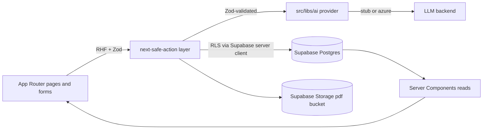

# CVere v1 phased build

## Guiding constraints (from [INITIAL_PLANS.md](INITIAL_PLANS.md) and [AGENTS.md](AGENTS.md))

- Source-of-truth order: `profile` -> `achievement_log_entry` -> `job_description` -> derived `tailored_cv` / `cover_letter` -> exports.
- All mutations through `next-safe-action` + Zod. `authActionClient` for anything user-scoped.
- RLS `user_id = auth.uid()` on every new table. No client-side DB writes. No LLM calls outside `src/libs/ai`.
- Every LLM output passes a Zod check inside the provider before returning to actions.
- Stub provider is deterministic, simulates 300-800ms latency, marks user-visible strings with `[STUB]`, supports `AI_STUB_FAILURE_RATE`. UI shows a "Stubbed AI" badge while active.
- AI module lives at `src/libs/ai/` (boilerplate convention). Existing path notes in [INITIAL_PLANS.md](INITIAL_PLANS.md) referencing `src/lib/ai` are overridden.

## Architecture overview

## Phase 0 - Boilerplate neutralization and branding

Keep Stripe + Resend code on disk (per your choice) but remove them from the UX surface.

- Rename app in [src/config.ts](src/config.ts) (`APP_NAME`, `APP_DISPLAY_NAME`, `APP_DESCRIPTION`, `STRIPE_APP_NAME`).
- Update `name` in [package.json](package.json) (only metadata; no script changes).
- Replace landing in [src/app/page.tsx](src/app/page.tsx) with a CV-focused hero pointing to `/login` and (when authed) `/profile`.
- Trim [src/app/(account)/account/page.tsx](src/app/(account)/account/page.tsx) to drop the Subscription card and the `Manage Subscription` link; keep auth identity only.
- No deletions of [src/app/api/webhooks/route.ts](src/app/api/webhooks/route.ts), [src/app/(account)/manage-subscription/route.ts](src/app/(account)/manage-subscription/route.ts), Stripe libs, or `features/emails/*`. They stay dormant.

## Phase 1 - Domain schema + RLS

One migration via `npm run migration:new cv_domain` then fill it in. Tables (all with `user_id uuid not null references auth.users on delete cascade`, `enable row level security`, and a single policy `using (auth.uid() = user_id) with check (auth.uid() = user_id)`):

- `profile` (1 row per user, `unique(user_id)`): `summary text`.
- Profile children (each `profile_id uuid references profile on delete cascade`, `position int not null`): `experience`, `project`, `skill`, `education`, `certification`, `language`. Index `(user_id, profile_id, position)`.
- `achievement_log_entry`: `raw_text`, `normalized_text`, `target_section`, `status achievement_status`, `integrated_at timestamptz`. Check: `status <> 'integrated' or integrated_at is not null`.
- `job_description`: `company`, `role`, `raw_text`, `extracted jsonb`.
- `tailored_cv`: `job_description_id`, `profile_snapshot jsonb`, `sections jsonb`, `status cv_status`, `slug text`, `pdf_path text`. Unique `(user_id, slug)`.
- `cover_letter`: `job_description_id`, `body text`, `slug`, `pdf_path`. Unique `(user_id, slug)`.
- `advice_note`: `target advice_target`, `target_ref_id uuid`, `severity advice_severity`, `text`, `status advice_status`.
- `interview_answer`, `interview_advice` (mirror advice shape).
- Enums: `achievement_status('pending','integrated','dismissed')`, `cv_status('draft','final')`, `advice_target('summary','experience','projects','skills','education','certs','languages','global')`, `advice_severity('info','weak','gap')`, `advice_status('open','applied','dismissed')`.
- Storage: private bucket `pdf` with policy "owner-read" derived from path prefix `pdf/{user_id}/`.
- Run `npm run generate-types` to refresh [src/libs/supabase/types.ts](src/libs/supabase/types.ts).

Constraint reminder for app code (not enforceable in SQL): `tailored_cv` and `cover_letter` writes never touch `profile` rows.

## Phase 2 - AI provider scaffold (stub-first)

Single interface, one method per task. Layout under `src/libs/ai/`:

- [src/libs/ai/types.ts](src/libs/ai/types.ts) - Zod schemas for every input + output (`extractedJdSchema`, `tailoredCvSchema`, `coverLetterSchema`, `adviceNoteSchema`, etc.).
- [src/libs/ai/provider.ts](src/libs/ai/provider.ts) - `AiProvider` interface: `extractJobDescription`, `normalizeAchievement`, `tailorCv`, `generateCoverLetter`, `reviewProfile`, `interviewAnswer`, `interviewReview`.
- [src/libs/ai/stub.ts](src/libs/ai/stub.ts) - deterministic outputs derived from a hash of the input, `[STUB]` prefixes on user-visible strings, `await sleep(rand(300,800))`, throws when `AI_STUB_FAILURE_RATE` triggers.
- [src/libs/ai/azure.ts](src/libs/ai/azure.ts) - thin placeholder that throws "not configured" until env is set.
- [src/libs/ai/index.ts](src/libs/ai/index.ts) - factory: `getAiProvider()` reads `AI_PROVIDER`, returns one instance, asserts Zod on every method's return.
- [src/components/stubbed-ai-badge.tsx](src/components/stubbed-ai-badge.tsx) - small client badge rendered in the app shell when `AI_PROVIDER !== 'azure'`.

Env additions to `.env.local.example`: `AI_PROVIDER=stub`, `AI_STUB_FAILURE_RATE=0`.

## Phase 3 - App shell, routes, guards

- New route group [src/app/(app)/layout.tsx](src/app/(app)/layout.tsx) with sidebar/topbar nav: Dashboard, Profile, Achievements, Jobs, Tailored, Letters, Advice, Interview, plus the Stubbed AI badge.
- Update [src/proxy.ts](src/proxy.ts) middleware matcher and guard to also protect `/(app)` paths (`/profile`, `/achievements`, `/jobs`, `/jobs/:id`, `/tailored/:id`, `/letters/:id`, `/advice`, `/interview`).
- Add shadcn components as needed (`tabs`, `card`, `form`, `textarea`, `badge`, `separator`, `tooltip`, `select`, `dialog`) via the shadcn CLI.

## Phase 4 - Profile editor (the only place that mutates facts)

- Controllers: `src/features/profile/controllers/get-profile.ts`, `get-profile-children.ts` (server, RLS-scoped).
- Zod: `src/features/profile/schemas.ts` covering `summary`, `experience`, `project`, `skill`, `education`, `certification`, `language`.
- Actions: `src/features/profile/actions/update-profile-section.ts` using `authActionClient`. Single action keyed by `section` enum, dispatching to per-section upsert helpers; preserves `position` ordering.
- One canonical reusable component `src/features/profile/components/fact-editor.tsx` with `mode: 'edit' | 'read'` and optional `emphasis` prop for tailored views.
- Page [src/app/(app)/profile/page.tsx](src/app/(app)/profile/page.tsx) with section tabs.

## Phase 5 - Achievements inbox

- Actions: `addAchievement`, `integrateAchievement(id)`, `dismissAchievement(id)` in `src/features/achievements/actions/`.
- `addAchievement` calls `getAiProvider().normalizeAchievement(rawText)` -> persists `normalized_text` + `target_section`, status `pending`.
- `integrateAchievement` runs in a transaction-equivalent flow: writes a child row into the appropriate profile table, then sets `status='integrated'`, `integrated_at=now()`.
- Page [src/app/(app)/achievements/page.tsx](src/app/(app)/achievements/page.tsx) with `nuqs` filters (`status`, `section`).

## Phase 6 - Job descriptions + diff

- Action `ingestJobDescription({ rawText, company?, role? })` -> AI `extractJobDescription` -> store row with `extracted` jsonb.
- List page [src/app/(app)/jobs/page.tsx](src/app/(app)/jobs/page.tsx).
- Detail page [src/app/(app)/jobs/[id]/page.tsx](src/app/(app)/jobs/[id]/page.tsx) renders three columns (matches / weak / gaps) computed server-side from `extracted` against current profile, plus buttons that submit `tailorCv` and `generateCoverLetter`.
- Diff helper in `src/features/jobs/diff.ts` (pure, unit-testable).

## Phase 7 - Tailored CV

- Action `tailorCv(jobDescriptionId)`: snapshot profile into `profile_snapshot`, call `tailorCv` AI method, store `sections` + `summary`, status `draft`.
- Page [src/app/(app)/tailored/[id]/page.tsx](src/app/(app)/tailored/[id]/page.tsx) using `fact-editor` in `read` mode (with emphasis) for facts and a separate presentation editor for ordering / summary copy. Hard rule enforced in actions: this route never writes back to `profile` tables.

## Phase 8 - Cover letter

- Action `generateCoverLetter(jobDescriptionId)`.
- Page [src/app/(app)/letters/[id]/page.tsx](src/app/(app)/letters/[id]/page.tsx) with editable body and an export button.

## Phase 9 - Advice (critique store)

- Actions `reviewCv()` (populates `advice_note` rows), `applyAdvice(id)`, `dismissAdvice(id)`.
- Apply paths only mutate presentation rows (`tailored_cv.sections`, `cover_letter.body`) - never `profile`.
- Page [src/app/(app)/advice/page.tsx](src/app/(app)/advice/page.tsx) grouped by `target`. Inline annotations next to bullets in the tailored editor with explicit Apply / Dismiss buttons.

## Phase 10 - PDF export

- `src/pdf/theme.ts` (page size, margins, colors, typography), shared primitives `Section`, `Bullet`, `Header`, `Sidebar`.
- `src/pdf/Cv.tsx`, `src/pdf/CoverLetter.tsx`. Fonts registered once at module scope.
- Action `exportPdf({ kind, id })` in `src/features/exports/actions/export-pdf.ts`:
  1. Load row with RLS server client.
  2. `renderToBuffer(<Cv .../>)` or `<CoverLetter .../>`.
  3. Upload to `pdf/{user_id}/{slug}.pdf` (overwrite allowed for redrafts).
  4. Update `pdf_path` on the row.
- Filenames are lowercase snake_case (`triodos_backend_engineer_cv.pdf`).

## Phase 11 - Interview prep

- Actions `addInterviewAnswer`, `reviewInterview`, `applyInterviewAdvice`, `dismissInterviewAdvice` mirroring CV review.
- Page [src/app/(app)/interview/page.tsx](src/app/(app)/interview/page.tsx) with question/answer pairs and an advice column.

## Phase 12 - Dashboard

- [src/app/(app)/page.tsx](src/app/(app)/page.tsx) (route `/`) for authed users:
  - Profile completeness % (computed from required fields).
  - Pending achievements count.
  - Open advice count.
  - Recent tailored variants and letters.
- For unauthed visitors keep the public landing at `/(public)/page.tsx` or a redirect; decide at the start of Phase 3.

## Cross-cutting checklist (apply throughout)

- Run `npm run build` after each phase to catch type errors early (per [AGENTS.md](AGENTS.md)).
- After every schema change run `npm run generate-types`.
- Never use `any`. No `memo` / `useMemo` / `useCallback` unless profiling demands it (React Compiler is on).
- Use `sonner` for action feedback. Use `nuqs` for any filter / sort / tab state.
- Single Zod schema shared between client form and server action per feature.
- Never invent facts in AI output. Stub returns `[MISSING]` placeholders where the input lacks data.

## Open items to revisit later (not in v1)

- Switching `AI_PROVIDER=azure` and wiring `AZURE_OPENAI_*` env.
- Cleanup of the dormant Stripe + Resend code if the project stays single-tenant.
- Optional Tectonic-based PDF worker for higher-fidelity typography.
