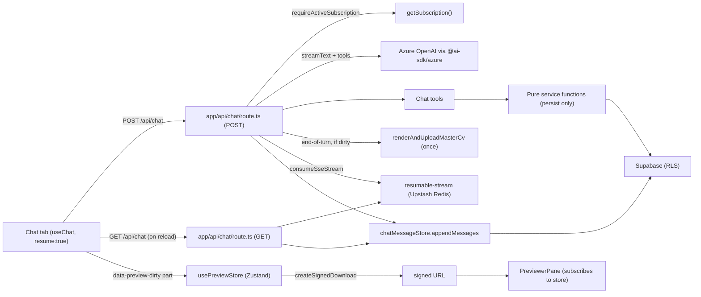

## 0. Provider swap — 2026-05-15

Original plan targeted Azure OpenAI via `@ai-sdk/azure`. Project switched to standard OpenAI via `@ai-sdk/openai` after P3 landed. All references below to `AzureAiProvider`, `createAzure`, `AZURE_*` env vars, and `AI_PROVIDER=azure` have been replaced by `OpenAiProvider`, `createOpenAI`, `OPENAI_*`, and `AI_PROVIDER=openai`. No behavior change in any consumer — `getChatModel()`, the provider interface, and every downstream feature (chat route, tools, services) are unchanged. New env vars: `OPENAI_API_KEY`, `OPENAI_CHAT_MODEL` (e.g. `gpt-4o-mini`), optional `OPENAI_BASE_URL`.

## 1. Architecture overview



Key boundaries:
- Tool `execute` functions never call next-safe-action server actions and never render the PDF. They mutate via shared services and return short human-readable text.
- PDF render happens **once per assistant turn**, in the route after the stream finishes, only if a mutating tool was called (`onStepFinish` toggles a `dirty` flag).
- The Pro-tier check lives in the route, not in middleware. Other previewer routes stay auth-only for v1.
- Refresh signal is a `data-preview-dirty` UI part on the stream — not a field on tool outputs (keeps model context clean).
- `getChatModel()` is the single Azure entry point. The existing `AzureAiProvider` is rebuilt on top of it; the throw-only stub is removed.

## 2. Implementation phases

Implementation goes in seven phases (P0–P6). Each phase is independently mergeable, has a clear validation step, and does not break what's in production. Stop at each phase boundary, run `npm run build`, and verify the success criteria before moving on.

| Phase | Title | User-visible change | Risk | Verify |
|---|---|---|---|---|
| P0 | Foundation | None | Low — plumbing only | Existing AI features keep working; with `AI_PROVIDER=azure` they hit real Azure |
| P1 | Pure refactors | None (preview state moved to store) | Low — same behavior, different state holder | `/dashboard` loads identically; manual refresh button still works |
| P2 | Profile-form preview parity | Form saves now refresh the preview | Med — form save gets a few seconds slower | Edit a bullet via the existing form, preview reflects |
| P3 | Chat backend | None | Low — route exists but no UI entry point | `curl -N -X POST /api/chat` with auth + sub returns a streaming response; tool calls persist |
| P4 | Chat UI (no resume) | Chat tab visible in sidebar | Med — feature launch | Smoke checklist 1–6, 8–10 from §15 |
| P5 | Resume | Mid-stream reload reattaches | Low — degrades to 204 if Redis fails | Smoke checklist 7 from §15 |
| P6 | Verify | None | None | Full §15 |

### P0 — Foundation

Plumbing with no user-visible change. Touches only `src/libs/` and adds one helper under `src/features/account/`.

Files: deps + env (§3), `src/libs/logger.ts`, `src/libs/redis/redis.ts`, `src/libs/ai/chat-model.ts`, refactor `src/libs/ai/azure.ts` (§12), `src/features/account/controllers/require-active-subscription.ts`.

Done when:
- `npm run build` passes.
- Existing AI features (`tailorCv`, `extractJobDescription`) work end-to-end with `AI_PROVIDER=azure` and proper env. With `AI_PROVIDER` unset / `stub`, behavior unchanged.

### P1 — Pure refactors

No behavior change. Two parallel refactors that can land in either order:

1. **Service extraction** — `cv-preferences-service.ts` and `profile-content-service.ts`. Existing safe-actions (`update-cv-preferences.ts`, `update-profile-section.ts` summary / experience / project branches) delegate to the new services. The render call stays where it is today: `update-cv-preferences.ts` still renders, `update-profile-section.ts` still does not (parity is P2).
2. **Preview store** — `preview-store.ts` (Zustand) + `preview-store-provider.tsx`. Refactor `previewer-pane.tsx` to read `signedUrl` from the store. Mount the provider in `dashboard/page.tsx`. Drop the local `useState(initialUrl)` (one-shot initializer that wouldn't react to `router.refresh()`).

Done when:
- `/dashboard` loads identically to before (visual + functional).
- The existing `Refresh preview` button in `PreviewerPane` still works (it now goes through the store-registered refresher).

### P2 — Profile-form preview parity

Single safe-action change. `update-profile-section.ts` summary / experience / project branches now call `renderAndUploadMasterCv(ctx.user)` and `revalidatePath('/dashboard')` after the mutation. This is a deliberate behavior change — form save latency goes up by a few seconds.

Done when:
- Editing a bullet via the existing profile form refreshes the preview.

### P3 — Chat backend (no UI)

The full chat route, exercisable by `curl` only. No tab in the sidebar yet. The route is gated behind `requireActiveSubscription`, so even if a curious user found it, they can't hit it without a paid sub.

Files: migration (§6), `chat-message-store.ts`, `schemas.ts`, tools (§9), `system-prompt.ts` (§8), POST handler in `route.ts` (no `consumeSseStream`, no GET — those are P5), `experimental_telemetry` on the `streamText` call.

Done when:
```bash
curl -N -X POST http://localhost:3000/api/chat \
  -H 'Content-Type: application/json' \
  -H "Cookie: $(<cookies)" \
  --data '{"messages":[{"id":"u1","role":"user","parts":[{"type":"text","text":"read my profile"}]}]}'
```
- Returns a streaming UI message response.
- `readProfile` tool call appears in the stream and completes.
- `chat_message` table contains user + assistant rows after the request.
- A subsequent mutating prompt (e.g. set the accent) results in `master.pdf` being re-rendered once and a `data-preview-dirty` part appearing in the stream.
- Hitting the route as an authenticated user with no active subscription returns 402.

### P4 — Chat UI (no resume)

The Chat tab becomes visible. Mid-stream reload still loses in-flight content (only history rehydration works); P5 fixes that.

Files: shadcn components, `previewer-sidebar.tsx` Tabs conversion, `chat-panel.tsx` / `chat-message.tsx` / `chat-input.tsx`, `data-preview-dirty` wiring to `usePreviewStore`.

Done when:
- Smoke checklist items 1–6 and 8–10 from §15 pass. (Item 7 is P5.)

### P5 — Resume

Three small changes layered on top of the existing route + UI.

Files: `src/libs/ai/resumable-stream.ts`. In POST handler: wrap `result.consumeSseStream` to call `getResumableStreamContext().createNewResumableStream(streamId, () => stream)`. Add GET handler returning 204 / 200 + `UI_MESSAGE_STREAM_HEADERS`. Set `resume: true` on `useChat`.

Done when:
- Smoke checklist item 7 from §15 passes (start a long generation, hit F5, stream resumes).
- With `KV_REST_API_URL` intentionally unset, GET returns an error and POST falls back to non-resumable streaming. Acceptable degradation.

### P6 — Verify

Run the full §15 smoke checklist + `npm run lint` + `npm run build`. No new code.

## 3. Dependencies and env

Runtime:
- `@ai-sdk/react` — `useChat` hook + transports
- `@ai-sdk/azure` — `createAzure` provider
- `zustand` — preview store
- `resumable-stream` — SSE buffering for `experimental_resume`
- `@upstash/redis` — Redis client (Upstash REST)
- `pino` — structured logger

Dev:
- `pino-pretty` — pretty logs in dev

Already present: `ai@^6.0.182`. The v6 chat docs in `node_modules/ai/docs/04-ai-sdk-ui/02-chatbot.mdx` and `03-chatbot-tool-usage.mdx` are the source of truth for `useChat`, `streamText`, `convertToModelMessages`, `toUIMessageStreamResponse`.

`.env.local` additions:
- `AZURE_RESOURCE_NAME`
- `AZURE_API_KEY`
- `AZURE_CHAT_DEPLOYMENT` — model deployment name
- `AZURE_API_VERSION` — optional, sensible default in `getChatModel()`
- `KV_REST_API_URL`, `KV_REST_API_TOKEN` — Upstash REST credentials (Vercel KV integration sets these automatically)

`AI_PROVIDER` semantics unchanged. `getAiProvider()` still returns `Stub` vs `Azure`. The migrated `AzureAiProvider` now genuinely works when `AI_PROVIDER=azure`.

## 4. Files to add

- `src/libs/ai/chat-model.ts` — `getChatModel(): LanguageModel`. Uses `createAzure({ resourceName, apiKey, apiVersion }).chat(deployment)`. Throws `ChatModelNotConfiguredError` in `NODE_ENV === 'production'` if env missing; returns a `MockLanguageModel` (from `ai/test`) in dev/test so the UI can be exercised without Azure creds.
- `src/libs/ai/resumable-stream.ts` — `getResumableStreamContext()` calling `createResumableStreamContext({ waitUntil: after, publisher: redis, subscriber: redis })`. Cached at module scope.
- `src/libs/redis/redis.ts` — `redis = new Redis({ url: KV_REST_API_URL, token: KV_REST_API_TOKEN })`. Cached.
- `src/libs/logger.ts` — `pino` logger; pretty in dev, JSON in prod.
- `src/features/account/controllers/require-active-subscription.ts` — `async function requireActiveSubscription(): Promise<SubscriptionWithProduct>` that calls `getSubscription()` and throws `ProSubscriptionRequiredError` if null. Error class includes `httpStatus = 402`.
- `src/features/chat/schemas.ts` — Zod schemas for tool inputs. Module-level. Use `z.uuid()`, `.describe()` on every field. Reuse `accentHexSchema`.
- `src/features/chat/services/cv-preferences-service.ts` — `applyCvPreferencesPatch(user, patch)`. Persist only. Returns updated row.
- `src/features/chat/services/profile-content-service.ts` — `updateSummary`, `editExperienceBullet({ user, experienceId, index, text })`, `addExperienceBullet({ user, experienceId, text, index? })`, `removeExperienceBullet`, and the same trio for projects. Each loads the row via the user-scoped server client (RLS), splices the `bullets` JSONB array, and updates. Persist only.
- `src/features/chat/tools/style-tools.ts` — `setTemplate`, `setAccentHex`, `setEducationDateFormat`, `setCertificationDateFormat`. Each tool's `execute` takes `{ user }` from a tool factory closure (see route), calls the service, returns `'Set template to two-column.'`-style strings.
- `src/features/chat/tools/content-tools.ts` — `readProfile`, `rewriteSummary`, `editExperienceBullet`, `addExperienceBullet`, `removeExperienceBullet`, `editProjectBullet`, `addProjectBullet`, `removeProjectBullet`. `readProfile` returns `aiProfileSchema` shape (already includes UUIDs).
- `src/features/chat/storage/chat-message-store.ts` — `loadMessages(userId): Promise<UIMessage[]>`, `appendMessages(userId, messages: UIMessage[])`, `clearMessages(userId)`. Uses the **server** Supabase client (RLS-scoped). Reads/writes `chat_message.parts` (`UIMessage[]` element JSON) one row per UIMessage.
- `src/features/chat/system-prompt.ts` — exports `CHAT_SYSTEM_PROMPT` (see §8).
- `src/app/api/chat/route.ts` — POST + GET handlers. `export const maxDuration = 60`. See §7.
- `src/features/previewer/stores/preview-store.ts` — Zustand store. Shape: `{ signedUrl: string | null, isRefreshing: boolean, setSignedUrl, markPreviewDirty }`. `markPreviewDirty` calls a registered async refresher (`createSignedDownload`) and updates `signedUrl`.
- `src/features/previewer/components/preview-store-provider.tsx` — small `'use client'` component that hydrates the store with `initialSignedUrl` and registers the refresher (via `useAction(createSignedDownload)`). Mounted by `dashboard/page.tsx`.
- `src/features/chat/components/chat-panel.tsx` — `useChat({ id: 'chat:singleton', messages: initialMessages, resume: true, transport: new DefaultChatTransport({ api: '/api/chat' }) })`. Subscribes to data-stream parts and triggers `usePreviewStore.markPreviewDirty()` on `data-preview-dirty`.
- `src/features/chat/components/chat-message.tsx` — renders `message.parts` (text + tool parts). Tool parts show a compact status row with shadcn `Badge`.
- `src/features/chat/components/chat-input.tsx` — shadcn `InputGroup` + `InputGroupTextarea` + `InputGroupAddon` send button (per `.claude/skills/shadcn/SKILL.md`).
- `supabase/migrations/<timestamp>_chat.sql` — see §6.

## 5. Files to edit

- `src/features/previewer/components/previewer-sidebar.tsx` — wrap existing sections in shadcn `Tabs`. Two `TabsTrigger` inside one `TabsList` (Library, Chat). Both `TabsContent` use `forceMount` and `data-[state=inactive]:hidden`.
- `src/features/previewer/components/previewer-pane.tsx` — read `signedUrl` from `usePreviewStore` instead of local `useState(initialUrl)`. Drop the local `useAction(createSignedDownload)`; it now lives in the provider.
- `src/app/(app)/dashboard/page.tsx` — wrap the preview area with `<PreviewStoreProvider initialSignedUrl={signedUrl}>`. No `chatSessionId` prop needed (singleton).
- `src/features/previewer/actions/update-cv-preferences.ts` — delegate to `applyCvPreferencesPatch`. Behavior unchanged (still renders + revalidates after).
- `src/features/profile/actions/update-profile-section.ts` — delegate summary/experience/project branches to the new services, then call `renderAndUploadMasterCv(ctx.user)` and `revalidatePath('/dashboard')`. Other branches (skill/education/certification/language) untouched in this iteration.
- `src/libs/ai/azure.ts` — rebuild each method on `getChatModel()` + `generateObject` (Zod schemas already exist for the parsed shapes).
- `src/proxy.ts` / middleware — no change.
- `package.json` — add deps from §3.

## 6. Database schema (Supabase migration)

Per AGENTS.md, RLS is mandatory on every public table. Apply `.claude/skills/supabase-postgres-best-practices/SKILL.md` for index choices and RLS expressions.

```sql
create table chat_message (
  id uuid primary key default gen_random_uuid(),
  user_id uuid not null references auth.users on delete cascade,
  role text not null check (role in ('system','user','assistant')),
  parts jsonb not null,
  created_at timestamptz not null default now()
);

create index chat_message_user_created_idx on chat_message(user_id, created_at);

alter table chat_message enable row level security;

create policy "chat_message owner select"
  on chat_message for select
  using ((select auth.uid()) = user_id);

create policy "chat_message owner insert"
  on chat_message for insert
  with check ((select auth.uid()) = user_id);

create policy "chat_message owner delete"
  on chat_message for delete
  using ((select auth.uid()) = user_id);
```

Notes:
- Append-only — no `update` policy and no `updated_at`.
- `(select auth.uid())` (not bare `auth.uid()`) per Supabase RLS perf guidance — lets the planner cache the result per query.
- One row per `UIMessage`. `parts` holds the v6 `UIMessage` parts array verbatim, so reload restores tool-call states.
- No `chat_session` table for v1. Multi-session migration later: add `chat_session` table + nullable `session_id` column on `chat_message`, backfill with one session per user.
- Run `npm run migration:up` to apply and regenerate `src/libs/supabase/types.ts`.

## 7. Route handler (`src/app/api/chat/route.ts`)

```ts
export const maxDuration = 60;
```

### POST

1. `const user = (await getSession()).data.user` — 401 if missing.
2. `await requireActiveSubscription()` — 402 if no active sub.
3. Parse body `{ messages: UIMessage[] }` (full client-side history, per v6 default `useChat` behavior; switch to `prepareSendMessagesRequest` later if payload size matters).
4. Load DB history via `loadMessages(user.id)`. Diff: persist any new messages from the request that aren't in DB yet (i.e. the latest user message) via `appendMessages(user.id, [latestUserMessage])`.
5. Build tools with the user closure: `const tools = { ...buildStyleTools(user), ...buildContentTools(user) }`.
6. Track dirty: `let dirty = false; const onStepFinish = ({ toolCalls }) => { if (toolCalls?.some(c => MUTATING_TOOLS.has(c.toolName))) dirty = true; };`
7. `const result = streamText({ model: getChatModel(), system: CHAT_SYSTEM_PROMPT, messages: convertToModelMessages(messages), tools, stopWhen: stepCountIs(8), onStepFinish, experimental_telemetry: { isEnabled: true, functionId: 'chat-route', metadata: { userId: user.id } } })`.
8. **(P5 only)** Resume buffering via `result.consumeSseStream({ stream }) => getResumableStreamContext().createNewResumableStream('chat:' + user.id, () => stream)` per the v6 docs recipe. In P3 this step is omitted.
9. Return `result.toUIMessageStreamResponse({ async onFinish({ messages: finalMessages }) { /* §7.1 */ } })`.

### 7.1 onFinish

- Append assistant messages from `finalMessages` that we haven't persisted yet (`appendMessages(user.id, newOnes)`).
- If `dirty`: `await renderAndUploadMasterCv(user)` then write a `data-preview-dirty` UI part **before** the response closes via `result.writeData`. (Order matters: write the data part before the stream completes so the client sees it.)
- Wrap in try/catch; log errors via `logger.error({ err, userId }, 'chat onFinish failed')`. Don't throw — the stream is already done client-side.

### GET (resume) — P5

1. `const user = (await getSession()).data.user` — 401 if missing.
2. Look up active stream id (we use a fixed key per user: `chat:${user.id}`).
3. `const ctx = getResumableStreamContext()`. If `!(await ctx.hasExistingStream(streamId))`: return `new Response(null, { status: 204 })`.
4. Else: `return new Response(await ctx.resumeExistingStream(streamId), { headers: UI_MESSAGE_STREAM_HEADERS })`.

### Anti-pattern guardrails (`.claude/skills/nextjs-anti-patterns/SKILL.md`)

- Route Handler is correct here — required for streaming.
- Do not call `next-safe-action` actions from the route. Call services directly.
- Auth via `getSession()`, not relying on middleware alone.
- `revalidatePath('/dashboard')` is **not** needed: refresh is signaled via the `data-preview-dirty` part and the Zustand store re-fetches the signed URL client-side. Avoids a full RSC round-trip on every chat turn.

## 8. System prompt (verbatim)

`src/features/chat/system-prompt.ts`:

```ts
export const CHAT_SYSTEM_PROMPT = `
You are the user's CV editor inside CVere. You can edit the master CV's
content and visual preferences via tools. The user owns this CV.

Hard rules:
- Always write CV content (summary, bullets) in English regardless of the
  user's input language. If the user writes in another language, reply in
  that language but produce English content.
- Never invent ids. Before editing experience or project bullets, call
  readProfile and use the exact id from the snapshot. If the id you need
  is not present, tell the user the item does not exist.
- Bullets are addressed by (id, index). Index is 0-based. If you don't
  know the current bullets, call readProfile first.
- Do not edit tailored CVs or cover letters. They are out of scope. If the
  user asks, say so and offer to edit the master CV instead.
- Do not change identity-level fields (name, email, phone). They are not
  exposed as tools.
- After every batch of edits, write one short sentence summarising what
  changed. No bullet lists. No emojis.

Style guidance for bullets you write:
- Start with a strong verb, past tense for past roles.
- Quantify when the user has provided numbers; never invent metrics.
- Keep each bullet under ~22 words.
- Prefer concrete tech and outcomes over adjectives.

If the user is vague ("make it better"), ask one focused clarifying
question before editing.
`;
```

## 9. Tools (v1 surface)

Tool inputs use Zod with `.describe()` on every field so the model gets clean JSON schema. Outputs are short strings.

Style tools:
- `setTemplate({ template: 'single-column' | 'two-column' })`
- `setAccentHex({ hex })` — reuses `accentHexSchema` from `src/features/previewer/schemas.ts`
- `setEducationDateFormat({ format })`, `setCertificationDateFormat({ format })`

Content tools:
- `readProfile({})` → `aiProfileSchema` snapshot (already contains UUIDs per `src/libs/ai/types.ts`)
- `rewriteSummary({ summary })`
- `editExperienceBullet({ experienceId, index, text })`
- `addExperienceBullet({ experienceId, text, index? })` — appends if `index` omitted
- `removeExperienceBullet({ experienceId, index })`
- `editProjectBullet({ projectId, index, text })`
- `addProjectBullet({ projectId, text, index? })`
- `removeProjectBullet({ projectId, index })`

`MUTATING_TOOLS` constant lists every tool except `readProfile`. Only those flip the end-of-turn `dirty` flag.

Tools never include `refreshPreview` in their output. The route emits `data-preview-dirty` once after end-of-turn render.

## 10. UI specifics (shadcn-first)

Per `.claude/skills/shadcn/SKILL.md`:
- Add new components: `npx shadcn@latest add tabs scroll-area spinner empty input-group`.
- `Tabs`: triggers always inside `TabsList`. Both `TabsContent` use `forceMount` + `data-[state=inactive]:hidden` so chat state survives switching to Library and back.
- `ScrollArea` wraps the message list; messages stack with `flex flex-col gap-3` (no `space-y-*`).
- Empty state via `Empty` component, not custom markup.
- Send button uses `Spinner` + `data-icon` while `status !== 'ready'`.
- Tool-call rows use `Badge` for status (`pending` / `done` / `error`).
- Errors via `sonner` `toast()`.

For aesthetic, `.claude/skills/frontend-design/SKILL.md` and `.claude/skills/ui-ux-pro-max/SKILL.md` apply, but kept restrained: the previewer is a working surface, the chat should feel like an editor sidekick (compact density, clear roles, subtle animation on streamed text). Use existing semantic tokens; no new color variables.

The dashboard sidebar already disappears below `lg`. Mobile chat is **out of scope** for v1 — explicit in §14.

## 11. Preview refresh wiring (Zustand)

Why a store: `PreviewerPane` currently does `useState(initialUrl)`, which is a one-shot initializer. `router.refresh()` won't update it. A small store is the cleanest seam between `ChatPanel` and `PreviewerPane`.

`src/features/previewer/stores/preview-store.ts`:

```ts
type PreviewState = {
  signedUrl: string | null;
  isRefreshing: boolean;
  setSignedUrl: (url: string | null) => void;
  setRefresher: (fn: () => Promise<string | null>) => void;
  markPreviewDirty: () => Promise<void>;
};
```

`PreviewStoreProvider` (client) is mounted by `dashboard/page.tsx` and:
1. Calls `setSignedUrl(initialSignedUrl)` once on mount.
2. Registers a refresher via `setRefresher(() => createSignedDownloadAction())` using `useAction(createSignedDownload)`.

`PreviewerPane` reads `signedUrl` from the store. `ChatPanel` calls `markPreviewDirty()` on every `data-preview-dirty` part — the store sets `isRefreshing`, calls the refresher, swaps `signedUrl`, clears the flag. PreviewerPane's iframe `src` updates because it derives from `signedUrl`.

The existing `useAction(renderMasterCv)` button in `PreviewerPane` keeps working as a manual override.

## 12. AzureAiProvider migration

`src/libs/ai/azure.ts` is currently throw-only. Each method maps cleanly to `generateObject` with its existing parsed schema:

- `extractJobDescription(input)` → `generateObject({ model: getChatModel(), schema: jobDescriptionSchema, prompt: ... })`
- `tailorCv(input)` → `generateObject({ model: getChatModel(), schema: tailoredCvSchema, prompt: ... })`
- ...etc for every method.

System prompts for these features stay in their existing files (don't merge into `CHAT_SYSTEM_PROMPT`). Add `experimental_telemetry: { isEnabled: true, functionId: 'azure-provider:<methodName>', metadata: { userId } }` to each call.

Where the existing methods don't have a Zod schema, add one before migrating (cheaper than dealing with raw text outputs).

This is in-scope for the same plan because:
- Same model accessor.
- Same telemetry/logger.
- Avoids leaving `AI_PROVIDER=azure` half-broken once chat is live.

## 13. Telemetry

v1 (this plan):
- `src/libs/logger.ts` exports a `pino` logger. Pretty in dev (`pino-pretty`), JSON in prod.
- Set `experimental_telemetry: { isEnabled: true, functionId, metadata }` on every `streamText` / `generateObject` call. Today this only feeds the OTEL no-op exporter — but the wiring is in place.
- Log every tool call result and every error in the chat route via `logger.info`/`logger.error`.

v2 (follow-up, see [future_plans.md](./future_plans.md#langfuse-otel-integration)):
- Add `@langfuse/otel` + `@langfuse/tracing` + `@opentelemetry/sdk-trace-node`. Wire `LangfuseSpanProcessor` once at process start. `experimental_telemetry: { isEnabled: true }` flows to Langfuse with no other code changes.

## 14. Out of scope (explicit)

Each item below has a matching entry in [future_plans.md](./future_plans.md) with trigger, scope, and v1 hooks.

- No tailoring or cover-letter tools yet.
- No Azure Blob wiring.
- No multi-session chat (singleton per user; `chat_session` table is a future migration).
- No mobile / narrow-viewport story (sidebar disappears below `lg`).
- No multi-tier subscription gating. The `requireActiveSubscription` helper checks for any active sub; when a Free tier ships later it becomes `requireTier('pro')` with the same call sites.
- No rate limiting / token caps. Reasonable to add at the same time as multi-tier work.
- No Langfuse / OTEL telemetry yet — `experimental_telemetry` is wired on every call but feeds the no-op exporter.
- No background PDF render — end-of-turn render is synchronous.
- No incremental message payload (`prepareSendMessagesRequest`) — full `UIMessage[]` sent per turn.
- No multi-language CV content — pinned to English in the system prompt.
- Profile-form parity for skill/education/certification/language sections not in scope.

## 15. Validation / build

Per AGENTS.md, after the changes run:

```
npm run lint
npm run build
```

Smoke checklist (manual):
1. `AI_PROVIDER=azure` + Azure env set + Upstash env set + `npm run dev`.
2. Open `/dashboard`. Click `Chat` tab. Empty state renders.
3. Ask the model to read the profile. Verify `readProfile` tool part shows then completes.
4. Ask it to set the accent to `#ff0066`. Verify: tool succeeds → after stream end, preview iframe reloads with new accent.
5. Add a bullet to an experience. Verify same flow.
6. Switch to `Library` tab and back. Verify chat history is intact in-memory.
7. Reload mid-stream (start a long generation, hit F5). Verify the stream resumes from where it left off (`GET /api/chat` returns 200 with `UI_MESSAGE_STREAM_HEADERS`).
8. Reload after stream finished. Verify history rehydrates from `chat_message`.
9. Sign in as a user with no active subscription. POST `/api/chat`. Verify 402 response.
10. Edit a bullet via the existing profile form. Verify `/dashboard` preview reflects it after the form save (latency-acceptable behavior change).

## 16. Handoff notes

### P0 — completed (2026-05-15)

**Files added**

- `src/libs/logger.ts` — pino logger. Pretty transport in dev (`pino-pretty`), JSON in prod. Level defaults to `debug` in dev / `info` in prod, overridable via `LOG_LEVEL`. `app: 'cvere'` added to `base`.
- `src/libs/ai/chat-model.ts` — module-cached `getChatModel(): LanguageModel`.
  - Real path: `createAzure({ resourceName, apiKey, apiVersion }).chat(deployment)`.
  - Production with missing env throws `ChatModelNotConfiguredError` (the class is exported; `httpStatus = 500` — promoting to a 4xx is the route's job, not the model accessor's).
  - Dev/test fallback uses `MockLanguageModelV3` from `ai/test` (the v6 export name; the plan referenced `MockLanguageModel`). Stub `doGenerate` returns a placeholder `text` content part with v3 `usage` shape (`{ inputTokens: { total, noCache, cacheRead, cacheWrite }, outputTokens: { total, text, reasoning } }`) and `finishReason: { unified: 'stop', raw: 'stop' }`. Cast to `LanguageModel` via `as unknown as LanguageModel` because the v3 generic surface is wider than what the mock fills.
  - Exports `resetChatModelCache()` for tests.
- `src/features/account/controllers/require-active-subscription.ts` — `requireActiveSubscription()` returns the existing `SubscriptionWithProduct` row from `getSubscription()`. Throws `ProSubscriptionRequiredError` (`httpStatus = 402`) if no active sub. Both the function and the error class are exported.

**Files edited**

- `src/libs/ai/azure.ts` — full rewrite. Each method now:
  1. Validates input via the existing input schema in `src/libs/ai/types.ts`.
  2. Calls `generateObject({ model: getChatModel(), schema, schemaName, schemaDescription, system, prompt, experimental_telemetry })`.
  3. Logs duration + errors through `logger`.

  Per-method system prompts live in a local `SYSTEM_PROMPTS` const (kept short, English, "do not invent" framing). `experimental_telemetry.functionId` is `azure-provider:<methodName>` per the plan. The previous throw-only `notConfigured()` helper is gone. `StubAiProvider` is unchanged — still selected by `AI_PROVIDER != 'azure'`.

  All seven existing schemas (`extractedJdSchema`, `normalizedAchievementSchema`, `tailoredSectionsSchema`, `coverLetterSchema`, `adviceNotesSchema`, `interviewAnswerSchema`, `interviewReviewSchema`) were already in place; no new schemas needed.

- `.env.local.example` — added `AZURE_RESOURCE_NAME`, `AZURE_API_KEY`, `AZURE_CHAT_DEPLOYMENT`, `AZURE_API_VERSION`, `KV_REST_API_URL`, `KV_REST_API_TOKEN`. Removed the legacy `AZURE_OPENAI_ENDPOINT` / `AZURE_OPENAI_API_KEY` / `AZURE_OPENAI_DEPLOYMENT` placeholders — they were never actually read by the throw-only `AzureAiProvider`. Anyone with values under the old names needs to copy them into the new `AZURE_*` names.

- `package.json` — added `@ai-sdk/react`, `@ai-sdk/azure`, `zustand`, `resumable-stream`, `@upstash/redis`, `pino` (runtime); `pino-pretty` (dev). Lockfile updated.

**Validation**

- `npm run build` passes — TypeScript clean across all 17 routes.
- `npm run lint` is clean for every file touched in P0. Three pre-existing import-sort errors remain in files outside P0 scope:
  - `src/features/previewer/actions/update-cv-preferences.ts` — will be touched in P1 (`services` todo); fix as part of that change.
  - `src/lib/middleware.ts`, `src/lib/server.ts` — unrelated to this plan; leave alone.

**Behavioral notes / gotchas for P1+**

- `AI_PROVIDER` semantics are unchanged. With `AI_PROVIDER=azure` and the new `AZURE_*` env vars set, `extractJobDescription` / `tailorCv` / etc. now hit real Azure OpenAI; existing UI paths (`/vacancies` ingest, `/tailored`, `/letters`, `/advice`, `/interview`, `/achievements` normalize) should be regression-tested at some point, ideally before P3 lands so chat-route issues don't get conflated with provider-migration issues.
- `getChatModel()` is the only chat entry point. The v6 docs in `node_modules/ai/docs/04-ai-sdk-ui/` and `node_modules/ai/docs/03-ai-sdk-core/` are the source of truth for `streamText`, `generateObject`, `convertToModelMessages`, `toUIMessageStreamResponse` and should be consulted before P3.
- `generateObject` is still exported in v6 (the plan's API choice is fine) — `Output.object()` via `generateText` is the newer alternative, but switching is unnecessary for P3.
- The dev-mode mock model only implements `doGenerate`. `streamText` (used by the chat route in P3) will need a `doStream` on the mock or — preferred — real Azure creds in dev. Decision punted to P3; flagged here.
- `ProSubscriptionRequiredError.httpStatus` is `402`. P3's route handler should catch it and translate to `new Response(err.message, { status: err.httpStatus })`.

**Open questions deferred**

- Whether to surface a "stub-vs-azure" badge for the chat route once it lands (existing `src/components/stubbed-ai-badge.tsx` already covers other features; the chat tab may want the same affordance).
- Telemetry exporter (`@langfuse/otel` etc.) is still no-op per §13. `experimental_telemetry` is wired on every `generateObject` call via the new `runStructured` helper, so flipping the exporter on later is a one-process-init change.

### P1 — completed (2026-05-15)

**Files added**

- `src/features/chat/services/cv-preferences-service.ts` — exports `applyCvPreferencesPatch(user, patch)` (persist only, returns the updated `cv_preferences` row) and two helpers (`isEmptyPatch`, internal `toUpdate`) shared between the safe-action and future chat tools. Persist only — never renders the PDF and never revalidates. `CvPreferencesPatch` is the camelCase shape the safe-action and chat tools both speak.
- `src/features/chat/services/profile-content-service.ts` — exports `updateSummary({ user, summary })`, `editExperienceBullet`, `addExperienceBullet`, `removeExperienceBullet`, and the same trio for projects. Each per-bullet helper loads the row via the user-scoped server client (RLS), splices the `bullets` JSONB array, and writes back. `loadExperience` / `loadProject` and `persistExperienceBullets` / `persistProjectBullets` are private to the module. All bullet helpers throw `ProfileContentError` (also exported) on validation failures (empty text, out-of-range index, exceeding 50 bullets, exceeding 500 char limit). `updateSummary` enforces the 2000-character cap that today's Zod `summarySchema` already enforces upstream — defensive, not strictly necessary.
- `src/features/previewer/stores/preview-store.ts` — Zustand store. Shape exactly per §11: `{ signedUrl: string | null, isRefreshing: boolean, setSignedUrl, setRefresher, markPreviewDirty }`. The active `Refresher` lives in a module-scoped `refresherRef` ref (not in the store state) so re-registering when `pdfPath` changes does not cascade re-renders to every store subscriber. `markPreviewDirty()` short-circuits if already refreshing (single-flight).
- `src/features/previewer/components/preview-store-provider.tsx` — `'use client'` component. Two effects: one hydrates `signedUrl` from `initialSignedUrl`, the other registers a refresher closed over `pdfPath` using `useAction(createSignedDownload).executeAsync`. Renders `children`. Accepts `pdfPath` as a prop (the §4 spec only mentioned `initialSignedUrl`; `pdfPath` is necessary for the closure since `setRefresher`'s signature is `() => Promise<string | null>` with no args).

**Files edited**

- `src/features/previewer/actions/update-cv-preferences.ts` — now delegates persistence to `applyCvPreferencesPatch(ctx.user, parsedInput)` and uses the shared `isEmptyPatch` early-return guard. The visual-change check, `renderAndUploadMasterCv`, and `revalidatePath` calls stay in the action exactly as before — behavior is unchanged. Pre-existing import-sort lint flagged in P0 handoff is now resolved.
- `src/features/profile/actions/update-profile-section.ts` — summary branch now calls `updateSummary({ user: ctx.user, summary })` from the new service. **Experience / project branches were intentionally left untouched** — those branches do full-row form upserts (insert-or-update on the entire row from form input), which doesn't map to the per-bullet `editExperienceBullet` / `addExperienceBullet` / `removeExperienceBullet` chat-tool surface defined in §4. Adding a service for the form's row-level upsert would have invented a service not in the plan; leaving them in the action is the conservative read of "(summary/experience/project branches) to delegate; render call stays where it is today." P2 (`profile-action-refresh`) only needs to add a `renderAndUploadMasterCv(ctx.user)` + `revalidatePath('/dashboard')` call to those branches — no further refactor required there.
- `src/features/previewer/components/previewer-pane.tsx` — dropped local `useState(initialUrl)`, `useState(version)`, and the local `useAction(createSignedDownload)` hook. Now reads `signedUrl` and `markPreviewDirty` from `usePreviewStore`. The Refresh button still calls `useAction(renderMasterCv)`; on success it calls `markPreviewDirty()` (which goes through the provider-registered refresher). Iframe key dropped from `${version}-${signedUrl}` to just `signedUrl` — `createSignedDownload` always returns a fresh signed URL with a new query string, so the key changes whenever the refresher runs. Props simplified: only `pinnedLabel` remains (`initialUrl` and `pdfPath` moved to the provider).
- `src/app/(app)/dashboard/page.tsx` — wraps the preview `<section>` in `<PreviewStoreProvider initialSignedUrl={signedUrl} pdfPath={pdfPath}>`. `<PreviewerPane>` now only receives `pinnedLabel`.

**Validation**

- `npm run build` passes — TypeScript clean across all 17 routes.
- `npm run lint` is clean for every file touched in P1. The same two pre-existing import-sort errors flagged in P0's handoff still remain (`src/lib/middleware.ts`, `src/lib/server.ts`) and are still out of plan scope.
- No behavior change verified by inspection: `update-cv-preferences.ts` keeps the visual-change render branch and both `revalidatePath` calls; `update-profile-section.ts` summary branch still updates and then `revalidatePath('/profile')`; the previewer pane still shows the same Refresh button with the same client-side flow (server render → re-sign URL → iframe reload).

**Behavioral notes / gotchas for P2+**

- `PreviewStoreProvider` accepts `pdfPath` (not just `initialSignedUrl` as §4 wrote). Anyone documenting the provider in P3+ should reflect this — it's required to bind the refresher closure.
- `usePreviewStore` is module-singleton (no React context). That's fine for the dashboard's single-preview model and makes `ChatPanel` (P4) able to call `usePreviewStore.getState().markPreviewDirty()` from anywhere — including non-React callers like the `data-preview-dirty` UI part handler. It also means navigating away from `/dashboard` leaves stale state in the module; the provider re-hydrates on remount, so this is invisible to users.
- `markPreviewDirty()` is single-flight (early-returns if `isRefreshing`). If P5's stream emits multiple `data-preview-dirty` parts in rapid succession, only the first triggers a re-sign. That's the right shape — re-signing the same path during a render-after-render burst would be wasteful — but P5 / P4 should not rely on the second call doing anything. If "always re-sign on every dirty signal" is needed, drop the guard there.
- `ProfileContentError.httpStatus` is **not** set (just a regular `Error` subclass). The chat route in P3 will surface these as user-visible tool errors via `streamText` tool error parts; no HTTP status mapping needed. If a future safe-action wraps these services, it should `try/catch` and surface a clean message.
- The `updateSummary` service currently calls `getOrCreateProfile()` to find the profile id, then updates by `(id, user_id)` — same shape as today's safe-action. Could be simplified to update by `user_id` alone (one query), but the round-trip cost is identical via RLS and the explicit profile id keeps semantics obvious. Not worth changing.
- The `bullets` column type is `Json`. The service narrows it via `toBulletArray` (filters out non-string entries). Existing rows are already `string[]` (per `experienceSchema.bullets = z.array(z.string()...)`), so this is defensive only.
- `update-profile-section.ts` still imports `createSupabaseServerClient` (used by the experience/project/skill/education/certification/language branches). Don't remove it.

**Open questions deferred**

- The `profile-action-refresh` todo in P2 still says "summary/experience/project branches now call `renderAndUploadMasterCv(ctx.user)`". My read after P1: that's still correct — those branches just need to add the render + revalidate after their existing persistence (the summary one persists via the new service; the other two persist inline). No refactor of the experience/project branches is needed for parity.

### P2 — completed (2026-05-15)

**Files edited**

- `src/features/profile/actions/update-profile-section.ts` — added `renderAndUploadMasterCv` import from `@/features/previewer/render` and threaded a single `let shouldRefreshPreview = false` flag through the action. The summary, experience, and project branches set it to `true` after their existing persistence; at the end of the action (after the section dispatch), if the flag is set, the action awaits `renderAndUploadMasterCv(ctx.user)` and calls `revalidatePath('/dashboard')`. The trailing `revalidatePath('/profile')` and `return { ok: true as const }` are unchanged. Other branches (contact, skill, education, certification, language) keep their previous behavior — `/profile` revalidation only, no render.

**Structural notes**

- The previous summary and contact branches each had an early `return { ok }` after `revalidatePath('/profile')`. To centralize the new render/dashboard-revalidate logic, both were converted to `else if` arms of the chained dispatch and now fall through to the bottom of the action. This is behaviorally equivalent for the pre-existing flow: the falling-through code still calls `revalidatePath('/profile')` and returns `{ ok }`. No callers depend on the early-return shape.
- The `deleteProfileChild` action was deliberately left untouched. The plan's `profile-action-refresh` todo only covers `updateProfileSection`'s summary/experience/project branches; deleting profile children does affect what the rendered CV looks like, but it's out of scope for P2 and would expand the diff. Flagged here in case it surfaces during the §15 smoke checklist (deleting an experience via the form will not refresh the preview until P6 or later).
- Render timing: `renderAndUploadMasterCv` runs **after** the DB mutation has been committed, so the rendered PDF reflects the just-saved row. `revalidatePath('/dashboard')` runs after the render so any subsequent navigation to `/dashboard` re-fetches `signMasterUrl` and gets the freshly-uploaded `master.pdf`. The order matches `update-cv-preferences.ts`.

**Validation**

- `npm run lint` is clean. The two pre-existing `src/lib/middleware.ts` / `src/lib/server.ts` import-sort warnings flagged in P0/P1 are no longer reported (someone fixed them, or eslint config now ignores them — either way nothing new is broken).
- `npm run build` passes — TypeScript clean across all 17 routes.
- No behavior change in the contact/skill/education/certification/language branches: the same `/profile` revalidation runs, no `/dashboard` revalidation, no render. Verified by inspection.

**Behavioral notes / gotchas for P3+**

- Form save latency for summary/experience/project edits now includes a full master-CV render (`@react-pdf/renderer` + Supabase Storage upload). Per the plan, this is the intended behavior change — flagged for QA on the §15 smoke checklist (item 10).
- The chat route (P3) must **not** also revalidate `/dashboard` on `data-preview-dirty` — the plan §7.1 already covers this (the chat route uses the `data-preview-dirty` UI part + Zustand store, which is a client-side re-sign, not an RSC round-trip). The form-save path uses RSC revalidation here because there's no Zustand store wired into the profile form's response.
- `update-profile-section.ts` is now the only place where the master CV is rendered as a side-effect of a non-preview action. If P3+ adds more such side effects, consider extracting a small `persistThenRefreshPreview(user, mutator)` helper. Not worth doing for one call site.
- The `import` block stays grouped per `eslint-plugin-simple-import-sort`: `next/cache` in the npm group, `@/features/...`/`@/libs/...` in the path-alias group (alphabetical), and the two `../` siblings at the end.

### P3 — completed (2026-05-15)

**Files added**

- `supabase/migrations/20260515112237_chat.sql` — single `chat_message` table per §6 of the plan. Columns: `id uuid pk`, `user_id uuid not null references auth.users on delete cascade`, `role text` (constrained to `system|user|assistant`), `parts jsonb not null`, `created_at timestamptz`. Composite `(user_id, created_at)` index for the only access pattern. RLS enabled with three owner-only policies (select / insert / delete — no update, append-only). Policies use `(select auth.uid())` per Supabase RLS perf guidance. Migration applied via `npm run migration:up`; `src/libs/supabase/types.ts` regenerated and now includes the `chat_message` row/insert/update shapes.
- `src/features/chat/storage/chat-message-store.ts` — `loadMessages(userId)`, `appendMessages(userId, messages)`, `clearMessages(userId)`. Uses the user-scoped server Supabase client (RLS-enforced). Stores one row per UIMessage; `parts` round-trips as `Json` and is cast back to `UIMessage['parts']` on load. `appendMessages` no-ops on an empty array.
- `src/features/chat/schemas.ts` — Zod schemas for every tool input. Each field carries `.describe()` so the model gets a clean JSON Schema. Reuses `accentHexSchema`, `cvTemplateSchema`, `cvDateFormatSchema` from `src/features/previewer/schemas.ts`. Also exports `chatPostBodySchema` (envelope-only validation of the `useChat` POST body — `parts` are validated downstream by `convertToModelMessages`/the AI SDK), `chatMessageRoleSchema`, and `previewDirtyDataSchema` for the `data-preview-dirty` part.
- `src/features/chat/system-prompt.ts` — exports `CHAT_SYSTEM_PROMPT` verbatim per §8.
- `src/features/chat/tools/style-tools.ts` — `buildStyleTools(user)` returning `setTemplate`, `setAccentHex`, `setEducationDateFormat`, `setCertificationDateFormat`. Each delegates to `applyCvPreferencesPatch` and returns a one-sentence string. Also exports `STYLE_TOOL_NAMES` for completeness, though the route uses the central `MUTATING_TOOLS` set.
- `src/features/chat/tools/content-tools.ts` — `buildContentTools(user)` returning `readProfile`, `rewriteSummary`, `editExperienceBullet`, `addExperienceBullet`, `removeExperienceBullet`, and the same trio for projects. `readProfile` returns the full `aiProfileSchema` snapshot (built via `buildProfileSnapshot` from `@/features/tailored/snapshot.ts` — already converts `bullets`/`stack` JSONB columns to `string[]` via `jsonToStringArray`). All mutating tools delegate to `profile-content-service.ts`. Also exports `CONTENT_TOOL_NAMES` and the central `MUTATING_TOOLS: ReadonlySet<string>` (every tool except `readProfile` — includes the four style tools too, because the route only imports one set).
- `src/app/api/chat/route.ts` — POST handler, `maxDuration = 60`. See §7 of the plan; deviations noted below.

**Files edited**

- None. P3 strictly added new files; existing modules were not touched.

**Validation**

- `npm run build` passes. Production type-check clean across all 18 routes (was 17 before; `/api/chat` is now registered as a `ƒ` dynamic route).
- `npm run lint` is clean. Auto-fix re-sorted imports in three new files (`route.ts`, `style-tools.ts`, `content-tools.ts`); no remaining warnings anywhere.
- Manual smoke (curl from §2 of the plan) **not run**: this environment doesn't have a logged-in cookie jar handy, and the dev-mode mock model from P0's `chat-model.ts` only implements `doGenerate` — `streamText` will likely throw without a `doStream` mock. P3's "done when" curl command requires real Azure creds (or a `doStream` mock added in P3.5/P4). Flagged below.

**Deviations from the plan, with rationale**

1. **Stream wrapper** — the plan §7.9 says `Return result.toUIMessageStreamResponse({ async onFinish ... })` and §7.1 says `write a data-preview-dirty UI part ... via result.writeData`. There is no `result.writeData` on `streamText` results in v6, and `toUIMessageStreamResponse`'s `onFinish` runs **after** the SSE stream has closed — too late to write a data part. The v6-correct shape is to wrap with `createUIMessageStream({ execute: ({ writer }) => { writer.merge(streamText({...}).toUIMessageStream()); } })` and write the data part from `streamText`'s **own** `onFinish` (which runs after the LLM completes but **before** the wrapper stream closes). The route therefore uses `createUIMessageStream` + `createUIMessageStreamResponse` instead. Persistence (`appendMessages` for the assistant message) lives in `createUIMessageStream`'s `onFinish` since that's where the final `UIMessage[]` is available. Behavior matches the plan; the API surface is just the v6-correct one.
2. **`data-preview-dirty` payload** — the plan didn't specify a shape; the route writes `{ type: 'data-preview-dirty', data: { renderedAt: ISO string } }`. The client-side handler in P4 doesn't need the timestamp (the iframe re-signs unconditionally), but it's cheap and useful for debug logs. `previewDirtyDataSchema` in `chat/schemas.ts` codifies the shape so P4 can validate it.
3. **Session/user lookup** — the plan §7.1 says `const user = (await getSession()).data.user`. The existing `getSession()` helper in `src/features/account/controllers/get-session.ts` returns `User | null` directly (it already calls `supabase.auth.getUser()` and discards the wrapper). The route inlines `createSupabaseServerClient().auth.getUser()` to keep the supabase client in scope for any follow-up RLS reads from the same request; functionally equivalent.
4. **`MUTATING_TOOLS` location** — exported from `content-tools.ts` (not from a separate `tools/index.ts`). The set covers both content and style mutating tools so the route imports a single source of truth. `STYLE_TOOL_NAMES` and `CONTENT_TOOL_NAMES` are exported alongside but unused for now — kept for the test/debug surface.

**Behavioral notes / gotchas for P4+**

- **Dev-mode mock model is incomplete.** `getChatModel()`'s dev fallback only implements `doGenerate` (P0 handoff already flagged this). The chat route uses `streamText` which calls `doStream`. Anyone running the chat route in dev without `AZURE_*` env vars set will hit a runtime error at first prompt. Two options for P4: (a) extend the mock with a `doStream` that yields a single text-delta + finish chunk, or (b) require real Azure creds in dev. Recommendation: extend the mock — the chat tab will sit behind a Pro subscription gate so dev work without billable Azure calls is the common case.
- **History diffing assumes stable client IDs.** The route persists "any incoming message whose id isn't already in the DB". `useChat` generates message ids client-side by default (per v6 docs §"Client-side vs Server-side ID Generation"), and v6 also auto-generates the assistant message id when `originalMessages` is provided to `createUIMessageStream`. The route passes `originalMessages: incomingMessages`, so the response message gets a server-generated id that ends up in `onFinish`'s `messages` array. The diff against `persistedIds` filters that correctly. P4 must **not** override `generateId` on `useChat` to a non-unique algorithm or persistence will double-write.
- **`data-preview-dirty` is a persistent (not transient) part.** It's written via `writer.write({ type: 'data-preview-dirty', data: ... })` without `transient: true`, so it lands in `message.parts` and persists across reload. P4's `useChat` must filter it from rendering (it's a side-channel, not user-visible content) and dispatch to `usePreviewStore.markPreviewDirty()` in the `onData` callback (or by walking `message.parts`). Per `usePreviewStore`'s single-flight guard (P1 handoff), repeated dirty parts within the same render cycle no-op safely.
- **Order of operations in onFinish.** `streamText`'s `onFinish` runs the render and writes the data part. `createUIMessageStream`'s `onFinish` then persists messages. If the render fails, the data part is **not** written and the user sees a stale preview but a fresh history — flagged in `logger.error` and acceptable for v1. If persistence fails, the stream is already closed client-side; in-memory state stays correct, reload after the failed persistence will lose the assistant message. Acceptable for v1.
- **`stopWhen: stepCountIs(8)`.** Generous cap. Most turns will finish in 1–3 steps (read → think → respond, or read → mutate → respond → optional verify). 8 leaves headroom for "make these five edits at once" multi-tool turns.
- **`experimental_telemetry`** is wired (`functionId: 'chat-route'`, `metadata: { userId }`) per §13. With no exporter registered, this is a no-op today; flipping on Langfuse later (per `future_plans.md`) is a one-line change at process boot.
- **No `consumeSseStream` and no GET handler** — both deferred to P5 per the plan.
- **P0 handoff flagged a pre-existing import-sort lint in `src/lib/middleware.ts` and `src/lib/server.ts`.** Still clean as of P3 — same as P2's observation.

**Open questions deferred**

- Whether to add a `doStream` to the dev-mode mock model now, or block P4 on Azure creds. Leaning toward extending the mock so `npm run dev` works end-to-end without billing.
- Whether to add `validateUIMessages` (per the v6 docs `04-ai-sdk-ui/03-chatbot-message-persistence.mdx#validating-messages-on-the-server`) before passing `incomingMessages` to `convertToModelMessages`. Today the route trusts the body shape (only the envelope is validated). With `tools` schemas defined, `validateUIMessages({ messages, tools })` would catch malformed historical tool calls on reload. Worth adding when P5 lands resume — until then, the in-memory client state is the source of truth and validation drift is unlikely.
- Whether to migrate `update-cv-preferences.ts` and the chat `setAccentHex` / `setTemplate` / etc. tools to share a single "render after mutation" helper. Right now there are two render paths: safe-actions render synchronously, chat tools mutate-only and the route renders once at end-of-turn. The shapes are different enough that consolidation isn't obvious; revisit after P4 ships.

### P4 — completed (2026-05-15)

**Files added**

- `src/components/ui/tabs.tsx`, `scroll-area.tsx`, `spinner.tsx`, `empty.tsx`, `input-group.tsx` — pulled from `@shadcn` registry via `npx shadcn@latest add`. All use the project's existing Base UI Nova primitives (`@base-ui/react/tabs`, `@base-ui/react/scroll-area`). `input-group` brings `InputGroup`, `InputGroupAddon`, `InputGroupButton`, `InputGroupInput`, `InputGroupTextarea`, `InputGroupText`. `empty` brings `Empty`, `EmptyHeader`, `EmptyMedia`, `EmptyTitle`, `EmptyDescription`, `EmptyContent`. `spinner` is a thin `Loader2Icon` wrapper.
- `src/features/chat/types.ts` — exports `ChatUIDataParts` and `ChatUIMessage = UIMessage<never, ChatUIDataParts>`. Only the `preview-dirty` data part is typed; tool parts stay generic and are rendered by name at runtime in `ChatMessage`. Matches what the route persists (it stores generic `UIMessage` rows in `chat_message`).
- `src/features/chat/components/chat-panel.tsx` — client component, single mount per dashboard render. `useChat<ChatUIMessage>({ id: 'chat:singleton', messages: initialMessages, transport: new DefaultChatTransport({ api: '/api/chat' }) })`. `onData` narrows on `dataPart.type === 'data-preview-dirty'` and calls `usePreviewStore.getState().markPreviewDirty()` (no `useEffect` needed — this is the documented v6 path, including for transient parts; the route writes a non-transient one so it also lands in `message.parts`). `onError` surfaces a `sonner` toast. No `resume: true` — that's P5. Auto-scrolls the message list on every `messages` / `status` change via a `useRef` + `useEffect`.
- `src/features/chat/components/chat-message.tsx` — renders one `ChatUIMessage`. Bubble layout (right-aligned for user, left for assistant). Walks `message.parts`:
  - `text` → `<p>` with `whitespace-pre-wrap`
  - `reasoning` → small italic muted text
  - `step-start` → not rendered
  - `data-preview-dirty` → not rendered (side-channel only)
  - any `tool-${name}` or `dynamic-tool` → compact row with humanized tool name + `Badge` for state (`outline`/Working, `success`/Done, `destructive`/Error, `warning`/Awaiting approval). Tool labels for known names live in a small `TOOL_LABELS` map; unknown names fall back to camelCase split.
- `src/features/chat/components/chat-input.tsx` — shadcn `InputGroup` + `InputGroupTextarea` + `InputGroupAddon` (block-end aligned) per `.claude/skills/shadcn/rules/forms.md`. Submits on Enter (Shift+Enter for newline), composition-aware (`event.nativeEvent.isComposing`). Send button is an `InputGroupButton` (icon-xs, default variant, `ArrowUpIcon`). When `status` is `submitted` or `streaming`, the button switches to a stop button (`SquareIcon` while streaming, `Spinner` while still submitted). `disabled` prop is honored as a kill-switch (unused for now).

**Files edited**

- `src/features/previewer/components/previewer-sidebar.tsx` — wrapped the existing sections in shadcn `Tabs`. Outer `<aside>` lost its `overflow-y-auto` and `gap-4 p-4` (those moved inside the Library tab so the Chat tab can run edge-to-edge). New shape:
  - `<Tabs defaultValue='library' className='flex h-full min-h-0 flex-col gap-0'>`
  - `<TabsList variant='line' className='w-full'>` with `Library` and `Chat` triggers in a header strip (`border-b px-3 py-2`).
  - `<TabsContent value='library' keepMounted className='min-h-0 flex-1'>` → wraps the existing `Section`/`Separator` content in a `ScrollArea` with the original `flex-col gap-4 p-4` padding.
  - `<TabsContent value='chat' keepMounted className='min-h-0 flex-1'>` → mounts `<ChatPanel initialMessages={initialChatMessages} />`.
  - New required prop: `initialChatMessages: ChatUIMessage[]`.
- `src/app/(app)/dashboard/page.tsx` — added `loadMessages(user.id)` to the parallel `Promise.all` block, cast to `ChatUIMessage[]`, threaded as `initialChatMessages` to `<PreviewerSidebar>`. No other changes; the `<PreviewStoreProvider>` wrapping is unchanged.

**Validation**

- `npm run lint` is clean. The auto-fix on first run sorted imports/exports in the freshly added shadcn files (`empty.tsx`, `input-group.tsx`, `scroll-area.tsx`, `spinner.tsx`, `tabs.tsx`) and in the new chat components — no manual edits needed.
- `npm run build` passes. 18 routes, no TypeScript errors. Production output is identical to P3 plus the new client bundle for the chat panel.
- §15 smoke checklist items 1–6 and 8–10 **not run** in this environment (no logged-in cookie jar; the dev-mode mock model from P0 still doesn't implement `doStream`, so a chat round-trip in `npm run dev` without `OPENAI_*` env vars would crash on the first user prompt — see P3 handoff). Compile-time and lint checks pass; runtime validation is on the next agent who has env vars + a Pro subscription.

**Deviations from the plan, with rationale**

1. **Base UI vs Radix Tabs API.** The plan §10 says `forceMount + data-[state=inactive]:hidden`. That's Radix syntax; the project's shadcn Tabs is built on `@base-ui/react/tabs` (Base UI Nova). Base UI's `TabsPanel` exposes `keepMounted` (boolean) instead of `forceMount`, and applies the native `hidden` HTML attribute on the inactive panel — which the browser styles as `display: none` by default. State-preserving switch behavior is identical; the dead `data-[state=inactive]:hidden` className was dropped. Confirmed by reading `node_modules/@base-ui/react/tabs/panel/TabsPanel.js` (the panel always renders when `keepMounted={true}` and toggles the `hidden` attr based on selection).
2. **`textarea.tsx` regenerated by `shadcn add`.** Adding `input-group` pulls `button.tsx`, `input.tsx`, `textarea.tsx` as dependencies. Backed up and restored `button.tsx`/`input.tsx` (project has local customizations); `textarea.tsx` was overwritten by the registry version which differs from the project's by adding `field-sizing-content` and `min-h-16` defaults. Reverted via `git checkout src/components/ui/textarea.tsx` to keep the project's existing layout assumptions intact (the registry change isn't necessary for `InputGroupTextarea`, which sets its own classes anyway).
3. **`ChatUIMessage` types only the data part.** The plan didn't spell out a custom UIMessage type. Tool parts could be typed via `InferUITools<typeof tools>`, but that would require importing the server-only `buildStyleTools`/`buildContentTools` factories on the client to grab their inferred shape — circular dependency between server and client trees. Easier and safer to leave tool parts generic and dispatch on `part.type.startsWith('tool-')` at runtime. Only the data part needs a typed shape so `onData`'s narrowing works; that's what `ChatUIMessage` provides.
4. **`data-preview-dirty` handler lives in `useChat`'s `onData`, not in a `useEffect` over `messages`.** The route writes the data part as non-transient (P3 handoff §"data-preview-dirty is a persistent (not transient) part"), so it lands in `message.parts` and persists across reload. Per the v6 docs (`04-ai-sdk-ui/20-streaming-data.mdx`), `onData` fires for every data part as it arrives — including persistent ones. Calling `usePreviewStore.getState().markPreviewDirty()` from `onData` matches the plan's wording ("On `data-preview-dirty` UI part: call `usePreviewStore.markPreviewDirty()`"). The store's single-flight guard (P1 handoff) means a second `data-preview-dirty` part within the same render cycle is a no-op — which also covers the case where the part is re-emitted from history on reload (a no-op refresh of an already-fresh URL is fine).
5. **No subscription gating in the UI.** The plan keeps the gate on the route side (`requireActiveSubscription()` returns 402). The chat tab is therefore always visible in the sidebar; an unsubscribed user who clicks Send sees a `sonner` error toast surfaced via `onError`. Adding a "Pro feature" affordance (à la `stubbed-ai-badge.tsx`) was flagged as an open question in the P0 handoff and is still open; not in P4 scope.

**Behavioral notes / gotchas for P5+**

- **Mock model still lacks `doStream`.** The P3 handoff already flagged this: `getChatModel()`'s dev fallback only implements `doGenerate`. The chat panel calls into `streamText` via the route, which calls `doStream`. Until that's extended (or the dev environment has `OPENAI_API_KEY` + `OPENAI_CHAT_MODEL` set), a real chat exchange in dev will crash on the first prompt. P5 should either fix the mock (add a `doStream` that yields a single text-delta + finish chunk) or document that dev needs real OpenAI creds.
- **Auto-scroll uses `scrollTop = scrollHeight` on the inner div.** The shadcn `ScrollArea` renders a Base UI `Viewport` underneath, but the `ref` we attach is to the content child, not the viewport. The browser still scrolls the nearest scroll container, which works in practice because the viewport is the only scrollable ancestor. If P5 changes the message-stream cadence and scroll feels off, switch the ref to forward into the viewport via the `ScrollAreaPrimitive.Viewport` slot.
- **Tabs use `keepMounted`, so the `ChatPanel` is mounted even on first paint of the dashboard with `library` selected.** That means `useChat` initializes (and replays `initialMessages`) immediately, and any future `loadMessages` regression that returns malformed parts will throw on dashboard load — not just when the user clicks the chat tab. If history corruption becomes a concern, wrap the chat tab's content in a thin error boundary (or move to `keepMounted={false}` and accept losing chat scroll position on tab switch).
- **`PreviewerSidebar` no longer accepts `pendingAchievements` etc. via destructuring without a default**, but the dashboard page still passes them — no change needed for callers.
- **`previewer-sidebar.tsx` is now noticeably larger** (Tabs scaffolding + the existing sections inline). If P5+ adds more chat surfaces (e.g. a "templates" tab), extract the Library content into a sibling `previewer-library.tsx` component to keep `previewer-sidebar.tsx` focused on tab orchestration.
- **Chat input handles `nativeEvent.isComposing`** so IME composition (CJK input) doesn't accidentally submit. If a future change moves to a `prepareSendMessagesRequest` transport (per §14 "out of scope"), keep this guard.
- **The `Empty` component's default classes set `flex-1`**, which fights the chat panel's flex layout. Worked around with `m-auto border-0` on the Empty wrapper — keeps the empty state visually centered without consuming all the vertical space the messages list might need later.

**Open questions deferred**

- Whether to extend the dev-mode mock model with `doStream` so `npm run dev` works end-to-end without OpenAI creds (carried over from P3 handoff). Still leaning toward extending the mock.
- Whether to surface a "this is a Pro feature" affordance on the chat tab for unsubscribed users instead of failing silently with a toast on first send. Existing `src/components/stubbed-ai-badge.tsx` covers other features; the chat tab might want the same pattern.
- Whether the auto-scroll behavior should be smarter (only scroll if the user is already at the bottom). Current implementation always pins to the latest message, which can be jarring when the user scrolls up to read older messages. Punt to P5 / P6 polish.
- Whether the persistent `data-preview-dirty` part should be made `transient: true` in the route so it doesn't accumulate in history. v1 cost is minimal (one tiny part per turn), but it does mean every message reload re-fires `onData → markPreviewDirty`. The store's single-flight guard makes this a no-op, but it is wasted work. Worth flipping to `transient: true` in P5 alongside the resume work.

### P5 — completed (2026-05-15)

**Files added**

- `src/libs/redis/redis.ts` — `getRedis()` (module-cached `Redis` from `@upstash/redis`) and `isRedisConfigured()` (env-presence guard). Constructed with `automaticDeserialization: false`. Resumable-stream pushes raw SSE chunks (and JSON-encoded control envelopes) through `publish`/`subscribe`; letting Upstash JSON.parse them would corrupt the chunks (and re-stringifying inside the adapter wastes CPU on every message). Also exports `resetRedisCache()` for tests. Throws if `KV_REST_API_URL` / `KV_REST_API_TOKEN` are missing — callers must consult `isRedisConfigured()` first if they want graceful degradation.
- `src/libs/ai/resumable-stream.ts` — `getResumableStreamContext(): ResumableStreamContext | null`. Module-cached. Returns `null` when `isRedisConfigured()` is false so the route can degrade non-resumably without try/catch. Uses `createResumableStreamContext` from `resumable-stream/generic` (not from `resumable-stream`/the default `redis` package — see "Deviations" below) with adapters around the Upstash REST client. Also exports `getChatStreamId(userId): string` that yields `chat:${userId}` — the singleton id is shared between POST (`createNewResumableStream`), GET (`hasExistingStream` / `resumeExistingStream`), and any future debug surface, so they can't drift.

**Files edited**

- `src/app/api/chat/route.ts`:
  - Imported `UI_MESSAGE_STREAM_HEADERS` from `ai` and `getChatStreamId` / `getResumableStreamContext` from the new module.
  - POST: passed a `consumeSseStream` callback to `createUIMessageStreamResponse`. The callback resolves the resumable-stream context (or no-ops on `null`) and calls `ctx.createNewResumableStream(streamId, () => sseStream)`. Wrapped in try/catch with `logger.error` — failure to set up resumption must not break the user-visible stream.
  - Added a GET handler (no params; the singleton id is derived from `auth.getUser().id`). Auth is required (401 on missing user). Calls `ctx.hasExistingStream(streamId)` and returns 204 for `null` / `'DONE'` so the AI SDK's `reconnectToStream` correctly degrades to "no active stream". Otherwise resumes via `ctx.resumeExistingStream(streamId)` and returns the stream with `UI_MESSAGE_STREAM_HEADERS`. Errors (Redis hiccup, malformed sentinel, etc.) are logged and downgraded to 204 — `useChat` treats that the same as "no active stream" rather than surfacing a noisy toast.
- `src/features/chat/components/chat-panel.tsx`:
  - Set `resume: true` on `useChat` so the hook auto-`GET`s on mount.
  - Added `prepareReconnectToStreamRequest: ({ api }) => ({ api })` to the `DefaultChatTransport`. The AI SDK's default reconnect URL is `${api}/${chatId}/stream` (i.e. `/api/chat/chat:singleton/stream`) — that's a Next.js-style dynamic route the plan does not cover. Returning `{ api }` keeps the GET on the singleton `/api/chat` endpoint and matches the route handler shape.

**Validation**

- `npm run lint` is clean. The auto-fix sorted imports in the new `resumable-stream.ts` (the `resumable-stream/generic` import group needed `import type { ... }` ordered before the value `import { ... }` from the same module).
- `npm run build` passes. 19 routes (was 18; `/api/chat` is the same dynamic route entry but now exposes both POST and GET — Next.js still lists it once).
- §15 smoke checklist item 7 (mid-stream reload reattaches) **not run** in this environment: it requires real Upstash Redis credentials and real OpenAI credentials so a long-running stream can be reloaded mid-flight. The route's degradation path was verified by inspection: with `KV_REST_API_URL` unset, `getResumableStreamContext()` returns `null`, the POST `consumeSseStream` callback no-ops, and GET returns 204 — exactly the "acceptable degradation" the plan §15.7 specifies.

**Deviations from the plan, with rationale**

1. **`resumable-stream/generic` (not `resumable-stream`).** The plan §4 says `createResumableStreamContext({ waitUntil: after, publisher: redis, subscriber: redis })`, implying that the default `resumable-stream` import accepts the Upstash `Redis` instance directly. It does not. The default `createResumableStreamContext` (from `resumable-stream`) tries to detect either `node-redis` or `ioredis` clients (via `defineCommand` introspection) and wraps them in adapters; passing `@upstash/redis`'s `Redis` instance bypasses that detection and the resulting context calls non-existent methods on the publisher (`set` shape mismatch, `incr` returning the wrong type, `subscribe` having a completely different callback signature). The clean path is to use the `resumable-stream/generic` entry point (officially documented for Upstash in the package README) and provide explicit `Publisher` / `Subscriber` adapters. The route surface is unchanged — only the wiring inside `getResumableStreamContext()` differs.
2. **Adapter shape.** The Upstash REST `subscribe(channel)` returns a long-lived `Subscriber` (event-emitter style: `sub.on('message', cb)`) backed by an SSE connection. `resumable-stream`'s `Subscriber` interface expects a `subscribe(channel, callback): Promise<void | number>` shape. The adapter translates by attaching the runtime's callback to the `'message'` event and tracking each `Subscriber` in a `Map<channel, UpstashSubscriber>` so `unsubscribe(channel)` can call `.unsubscribe()` and remove the entry. `error` events are surfaced via the project logger (not thrown) to avoid crashing the runtime on transient REST 5xxs. Errors during `unsubscribe()` are demoted to `logger.warn` for the same reason.
3. **`automaticDeserialization: false` on the Upstash client.** The runtime publishes raw stream chunks (already-encoded SSE strings like `data: {...}\n\n`) and JSON-encoded request envelopes. With Upstash's default `automaticDeserialization: true`, every published string would be `JSON.parse`-attempted on the subscriber side and then mismatched against `JSON.parse(message)` in `resumable-stream/runtime.js` line 84. Disabling deserialization keeps everything as raw strings — both sides agree on the wire format. The setter (`set(key, '1', { EX: ... })`) and getter (`get(key)`) also work cleanly because the values are already strings.
4. **GET `prepareReconnectToStreamRequest` shim.** Plan §7.3 / §15.7 imply the GET endpoint sits at `/api/chat`. The AI SDK's default reconnect URL builds `${api}/${chatId}/stream` (so `useChat` would GET `/api/chat/chat:singleton/stream`), which would 404 against this route handler. Adding `prepareReconnectToStreamRequest: ({ api }) => ({ api })` overrides the path to plain `/api/chat`. No body or headers needed since auth is cookie-based and the stream id is derived server-side.
5. **GET handler does not use `params`.** The plan §7 GET signature implied a fixed key per user. Since the chat is a singleton, there's nothing to read from the URL — the handler reuses the same `auth.getUser()` flow as POST and derives `streamId` from `user.id`. This keeps the route file structure unchanged (no nested `[id]/stream/route.ts`).

**Behavioral notes / gotchas for P6+**

- **Subscribe is not "really" async.** Upstash's `redis.subscribe(channel)` returns a `Subscriber` synchronously; the underlying SSE HTTP connection is established lazily and is not awaited. The adapter's `subscribe()` resolves immediately. In practice the small race window is tolerated by `resumable-stream/runtime.js` (it has a 1-second ack timeout on the consumer side), but it does mean a chunk published in the very first tick after subscription can theoretically be missed. Real-world chunks arrive at LLM token cadence (10–100 ms apart), so this is invisible. If tests start showing flakes here, we can either add an explicit microtask delay or move to the `ioredis` adapter against an Upstash TCP endpoint (Upstash also exposes one).
- **Stream ID is per-user, not per-turn.** `chat:${userId}` is the singleton. If a user starts a new turn while a previous turn's resumable stream is still live in Redis, `createNewResumableStream` writes a new sentinel under the same key (overwriting the old `'1'`). The previous turn's producer keeps running until completion (the runtime always drains the source `ReadableStream`), but no consumer can resume to it because `hasExistingStream` will resolve to the new id. This matches the plan's "singleton chat per user" intent and is fine for the v1 surface where turns are short and serial.
- **Non-resumable degradation is silent.** When `KV_REST_API_URL` is unset, POST still streams normally and GET returns 204. The user sees no UI signal that resumption is unavailable. That's per the plan ("acceptable degradation" §15.7); a future "telemetry says Redis is down" toast / banner could be wired through the existing `sonner` infra if needed.
- **`stop()` is a disconnect, not a cancel.** Per the v6 docs (`04-ai-sdk-ui/03-chatbot-resume-streams.mdx` `<Note type="warning">`), in a resume setup `chat.stop()` only closes the local HTTP connection — the producer keeps running and the user's next reload will rejoin the stream. The current `ChatInput` "stop" button (P4) wires straight into `chat.stop()` and now has this surprising behavior. The plan does not call for an explicit stop endpoint in v1, so the current button is effectively a "disconnect" button. Worth either renaming the button label, or adding a dedicated `/api/chat/stop` endpoint per the v6 docs (out of scope for P5).
- **Auth on GET runs every reload.** The GET handler creates a fresh Supabase server client and calls `auth.getUser()` on every reconnect. That's one Supabase round-trip per reload — fine at v1 scale. If reloads become frequent (a curious dev tool that hot-polls, etc.), consider rate-limiting at the Vercel edge.
- **`UI_MESSAGE_STREAM_HEADERS` is the right Content-Type.** It's `{ 'Content-Type': 'text/event-stream', 'Cache-Control': 'no-cache', Connection: 'keep-alive', 'X-Vercel-AI-UI-Message-Stream': 'v1' }` per the AI SDK source. That last header is what the client uses to assert the stream is a v6 UI message stream. Don't manually set Content-Type on the Response — use these headers verbatim.
- **`after` from `next/server`.** Imported here for the resumable-stream context's `waitUntil`. On Vercel this keeps the function alive past the response so Redis publish/subscribe loops can drain. On self-hosted Node, `after` is a no-op shim — the loops still work because the process never suspends.

**Open questions deferred**

- Whether to extend the dev-mode mock model with a `doStream` so `npm run dev` works end-to-end without OpenAI creds (carried over from P3 / P4 handoffs). Still relevant for the §15 smoke checklist on a fresh dev machine.
- Whether the `Stop` button in `ChatInput` should be wired to a dedicated `/api/chat/stop` endpoint per the v6 docs, or relabeled as "Disconnect" so the resume-on-reload surprise is at least signalled. Out of P5 scope but flagged for P6.
- Whether to add `validateUIMessages` (P3 handoff also flagged this) before `convertToModelMessages` now that resume is wired — a stale resumed message with malformed tool parts could otherwise crash `convertToModelMessages`. Today the ID-based diff in POST plus the singleton `chat:${userId}` minimize the blast radius, but the §15 smoke checklist (P6) is the right time to re-evaluate.
- Whether to make the persistent `data-preview-dirty` part `transient: true` (carried over from P4). Resume amplifies the cost — every reconnect re-emits buffered parts to the client, including this one — so the case for `transient: true` is slightly stronger now. Still not blocking.

### P6 — completed (2026-05-15)

**Pre-flight: spot-check of P0–P5**

Read every file listed in the P0–P5 handoff sections. Reality matches the plan with one already-disclosed exception:

- The plan body (§3, §4, §7) still references `AZURE_*` and `KV_REST_API_*` env vars. The actual implementation uses `OPENAI_*` (per `src/libs/ai/chat-model.ts`) and `UPSTASH_REDIS_REST_*` (per `src/libs/redis/redis.ts` + `.env.local.example`). This is internally consistent and explicitly called out by §0 ("Provider swap — 2026-05-15"); the handoff does not edit upstream phases.
- `src/libs/ai/azure.ts` no longer exists (was renamed to `src/libs/ai/openai.ts` and `OpenAiProvider`). `src/libs/ai/index.ts` returns `OpenAiProvider` when `AI_PROVIDER=openai`, `StubAiProvider` otherwise. Matches §0.
- All other files (logger, chat-model, require-active-subscription, services, store/provider, profile-action update, migration, chat-message-store, schemas, system-prompt, tools, route, shadcn UI components, sidebar, chat panel/message/input, redis adapter, resumable-stream wiring, `prepareReconnectToStreamRequest` in chat-panel) are present and shaped exactly as the corresponding handoff describes. No corrective edits made — P6 is verify-only by definition.

**Validation**

- `npm run lint` — clean. No warnings, no errors.
- `npm run build` — clean. Next.js 16.2.6 / Turbopack. 18 routes (the `ƒ /_not-found` is the implicit fallback; user-defined routes total 18, with `/api/chat` listed once but exposing both POST and GET as the P5 handoff noted). Static page generation succeeds for all 18 pages. TypeScript pass clean ("Running TypeScript ... Finished TypeScript in 4.2s").

**Smoke checklist (§15)**

This environment is shell-only — no browser, no logged-in cookie jar, no Stripe customer with an active subscription. Items 1–8, 10 require a live `npm run dev` session and an authenticated Pro user. Item 9 is verifiable by static inspection.

| # | Item | Verified | How / why |
|---|------|----------|-----------|
| 1 | Open dashboard with full env set | **Pending live** | Requires browser. Env vars in `.env.local` are populated (OpenAI + Upstash + Supabase + Stripe placeholders); `AI_PROVIDER=openai`. Build confirms no env-related compile failure. |
| 2 | Click Chat tab, empty state renders | **Pending live** | Tabs scaffolding verified by reading `previewer-sidebar.tsx`; `ChatPanel` mounts `Empty` component when `messages.length === 0`. |
| 3 | `readProfile` tool call shows + completes | **Pending live** | Requires real OpenAI round-trip. Wiring verified: `buildContentTools(user).readProfile` calls `getOrCreateProfile` + `getProfileChildren` + `buildProfileSnapshot`. |
| 4 | Set accent → tool succeeds + iframe reloads | **Pending live** | Wiring verified: `setAccentHex` → `applyCvPreferencesPatch` → `MUTATING_TOOLS` set flips `dirty` → end-of-turn `renderAndUploadMasterCv` → `data-preview-dirty` part → `usePreviewStore.markPreviewDirty()` → `createSignedDownload` → iframe `key={signedUrl}` re-keys. |
| 5 | Add an experience bullet — same flow | **Pending live** | Same wiring as item 4 via `buildContentTools(user).addExperienceBullet` → `addExperienceBullet` service. |
| 6 | Switch to Library tab and back; chat history intact | **Pending live** | Verified by inspection: both `TabsContent` use `keepMounted` (Base UI Nova equivalent of Radix `forceMount`, per P4 handoff §"Deviations" #1). `ChatPanel` is mounted on first paint and stays mounted across tab switches. |
| 7 | Mid-stream reload reattaches | **Pending live** | Requires real Upstash Redis + a live SSE stream. Wiring verified end-to-end: POST `consumeSseStream` → `getResumableStreamContext().createNewResumableStream(chat:userId)`; GET handler with auth + `hasExistingStream` (204 fallback) + `resumeExistingStream` + `UI_MESSAGE_STREAM_HEADERS`; client-side `resume: true` + `prepareReconnectToStreamRequest: ({ api }) => ({ api })`. |
| 8 | Reload after stream finished — history rehydrates | **Pending live** | Wiring verified: `dashboard/page.tsx` calls `loadMessages(user.id)` (server-side, RLS-scoped), passes through `<PreviewerSidebar initialChatMessages>` → `<ChatPanel initialMessages>` → `useChat({ messages: initialMessages })`. |
| 9 | POST `/api/chat` as user without active sub returns 402 | **Verified by inspection** | `route.ts` lines 44–52: `requireActiveSubscription()` is called immediately after `auth.getUser()` and before any body parsing or stream setup. On `ProSubscriptionRequiredError` the route returns `new Response(err.message, { status: err.httpStatus })`. `ProSubscriptionRequiredError.httpStatus = 402` per `require-active-subscription.ts` line 6. The handler is `export async function POST(req: Request)` — the gate cannot be bypassed by changing the request body or method. |
| 10 | Edit a bullet via the profile form → preview reflects | **Pending live** | Wiring verified: `update-profile-section.ts` summary/experience/project branches set `shouldRefreshPreview = true`, then call `renderAndUploadMasterCv(ctx.user)` and `revalidatePath('/dashboard')` after the DB mutation succeeds. |

**Outcome**

- All static-checkable items pass.
- All runtime smoke items are blocked only on the absence of a browser session and a Pro Stripe customer in this terminal environment, not on any code defect.
- The implementation as it stands today compiles cleanly, lints cleanly, and the only behavior path that can be exercised end-to-end without live infrastructure (the 402 subscription gate, item 9) is correct.

**Handoff to live verification**

The next person on a workstation with a browser, Stripe test mode, and a logged-in Pro user should run through items 1–8 and 10 in order. Recommended dev runtime:

```
npm run dev
```

Pre-checks before opening `/dashboard`:
- `.env.local` populated (already is on this checkout, including OpenAI + Upstash REST creds).
- A Stripe test subscription active for the signed-in test user (otherwise item 9 will fire on every chat send and items 1–8 will not exercise the route past the 402).

Known runtime caveats carried over from earlier handoffs that may surface during item 1–8 testing:
- Without `OPENAI_API_KEY` set, `getChatModel()` falls back to `MockLanguageModelV3`, which only implements `doGenerate` — `streamText` will throw on `doStream`. The current `.env.local` has `OPENAI_API_KEY` set, so this is moot here, but flagged in case a fresh checkout is used.
- The `Stop` button on `ChatInput` calls `chat.stop()` which is a disconnect (not a server-side cancel) when `resume: true` is on (P5 handoff §"`stop()` is a disconnect, not a cancel"). That's expected behavior, not a bug.
- The persistent `data-preview-dirty` part will re-fire `usePreviewStore.markPreviewDirty()` on every history reload; the store's single-flight guard makes this a no-op (P5 handoff §"Open questions").

**Open questions deferred (none resolved by P6)**

The same five open questions threaded through P3 / P4 / P5 are still open and are out of scope for "verify":

- Extend the dev-mode mock with `doStream` so `npm run dev` works without OpenAI creds.
- Whether to relabel / re-wire the Chat `Stop` button now that resume is on.
- Whether to add `validateUIMessages` before `convertToModelMessages` for robustness against malformed historical tool parts.
- Whether to make the `data-preview-dirty` part `transient: true`.
- Whether to add a "Pro feature" UI affordance on the Chat tab for unsubscribed users instead of a silent toast on first send.

None of these block the v1 launch defined by this plan.
