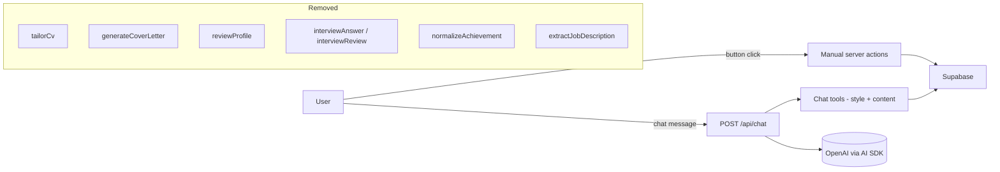

## Goal

Keep `src/app/api/chat/route.ts` (and everything it transitively needs) as the only AI entry point. Every other AI call is removed. Achievements and vacancies stay as manual, AI-free CRUD; the other four AI-only features are deleted entirely along with their tables.

## Architecture after the change

## Step 1 — Pre-deletion: relocate code the chat still needs

The chat agent and the master CV PDF renderer (which the chat route invokes via `renderAndUploadMasterCv`) currently import code that lives in soon-to-be-deleted modules. Move them into a chat/PDF-owned file first so deletions don't break the chat build.

- Create `src/features/chat/profile-snapshot.ts` containing `buildProfileSnapshot` (currently in [src/features/tailored/snapshot.ts](src/features/tailored/snapshot.ts)) and the inline `aiProfileSchema` + `AiProfile` type it depends on (currently in [src/libs/ai/types.ts](src/libs/ai/types.ts) lines 43-119). Inline the Zod schema here; after the deletions the chat/PDF pair is its only consumer.
- Drop `slugify` while relocating — it's only used by the tailored/letters actions being deleted in Step 3.
- Update the following imports to point at `@/features/chat/profile-snapshot` instead of `@/features/tailored/snapshot` or `@/libs/ai/types`:
  - [src/features/chat/tools/content-tools.ts](src/features/chat/tools/content-tools.ts) — `buildProfileSnapshot`
  - [src/pdf/render-master-cv.tsx](src/pdf/render-master-cv.tsx) — `buildProfileSnapshot`
  - [src/pdf/templates/shared.tsx](src/pdf/templates/shared.tsx) — `type AiProfile`

## Step 1b — Pre-deletion: preserve the previewer's signed-URL action

[src/features/previewer/components/preview-store-provider.tsx](src/features/previewer/components/preview-store-provider.tsx) imports `createSignedDownload` from `@/features/exports/actions/export-pdf`. This is the action the client calls when the chat route emits `data-preview-dirty` — without it the preview iframe never re-signs after a chat edit. The action is independent of tailored/letters PDFs (it just signs an owner-scoped storage path).

- Create `src/features/previewer/actions/sign-pdf-url.ts` containing only `createSignedDownload` and its inline `signedDownloadSchema = z.object({ path: z.string().min(1) })`. Same `authActionClient`, same ownership check (`path.startsWith(`${ctx.user.id}/`)`).
- Update [src/features/previewer/components/preview-store-provider.tsx](src/features/previewer/components/preview-store-provider.tsx) to import from the new path.
- After this is in place, Step 3 can delete `src/features/exports/` wholesale.

## Step 2 — New migration: drop AI-derived tables and dead columns

Create `supabase/migrations/<timestamp>_drop_ai_features.sql` that does, in this order:

1. Drop FK column: `alter table cv_preferences drop column pinned_tailored_cv_id;`
2. `drop table if exists interview_advice cascade;`
3. `drop table if exists interview_answer cascade;`
4. `drop table if exists advice_note cascade;`
5. `drop table if exists cover_letter cascade;`
6. `drop table if exists tailored_cv cascade;`
7. Drop the `updated_at` triggers for those five tables.
8. `drop type if exists cv_status;` and `advice_target`, `advice_severity`, `advice_status` (only used by deleted tables — verify no other table references them).
9. `alter table job_description drop column extracted;` (extracted JD JSON is AI-derived).
10. Keep: `profile`, `experience`, `project`, `skill`, `education`, `certification`, `language`, `achievement_log_entry`, `job_description`, `cv_preferences`, `chat_message`, `customers`, `users`, `products`, `prices`, `subscriptions`.

Run `npm run migration:up` afterwards to regenerate [src/libs/supabase/types.ts](src/libs/supabase/types.ts).

## Step 3 — Delete four feature directories wholesale

Delete in full:

- `src/features/tailored/` (entire folder)
- `src/features/letters/` (entire folder)
- `src/features/advice/` (entire folder)
- `src/features/interview/` (entire folder)
- `src/features/exports/` (entire folder — safe to delete only after Step 1b moved `createSignedDownload` out; the remaining `exportPdf` action and `ExportPdfButton` component are used only by the deleted tailored/letters editors)

Delete matching route directories:

- `src/app/(app)/tailored/`
- `src/app/(app)/letters/`
- `src/app/(app)/advice/`
- `src/app/(app)/interview/`

## Step 4 — Neuter the AI in achievements (keep the feature)

[src/features/achievements/actions/achievement-actions.ts](src/features/achievements/actions/achievement-actions.ts): rewrite `addAchievement` to drop the `getAiProvider().normalizeAchievement(...)` call. Insert with `normalized_text = null` and `target_section = null`; the existing `integrateAchievement` already accepts `targetSection` as input, so the user picks it on integration.

Surface-level UI tweaks:

- [src/features/achievements/components/add-achievement-form.tsx](src/features/achievements/components/add-achievement-form.tsx): change toast `'Captured. AI normalized the text.'` to `'Captured.'`, button label `'Normalizing...'` to `'Capturing...'`.
- [src/features/achievements/components/achievement-card.tsx](src/features/achievements/components/achievement-card.tsx): the existing "Awaiting normalization." fallback already covers null `normalized_text`. Change that copy to something like "Original text below." to reflect the new (permanent) reality, and consider removing the `
` "Original" disclosure since the main text is now the raw text. Keep the section `Select` since it now does real work.

## Step 5 — Neuter the AI in vacancies (keep the feature)

[src/features/jobs/actions/job-actions.ts](src/features/jobs/actions/job-actions.ts):

- `ingestJobDescription`: drop the `extractJobDescription` call, drop `extracted` from the insert.
- Delete `reExtractJobDescription` entirely.
- Keep `deleteJobDescription`.

[src/features/jobs/components/jd-actions.tsx](src/features/jobs/components/jd-actions.tsx): strip down to just the delete button. Remove imports of `generateCoverLetter`, `tailorCv`, `reExtractJobDescription` and their `useAction` blocks. Change props to `{ jobId: string }` (drop `hasExtracted`).

[src/features/jobs/components/jd-form.tsx](src/features/jobs/components/jd-form.tsx): button label `'Extracting...'` to `'Ingesting...'`.

[src/app/(app)/vacancies/[id]/page.tsx](src/app/(app)/vacancies/[id]/page.tsx): remove the `parseExtracted`/`buildJobDiff`/`DiffColumns` block; show only raw text + delete action. Strip imports of `getProfileChildren`, `getOrCreateProfile`, `parseExtracted`, `buildJobDiff`, `DiffColumns`.

Delete now-orphan files:

- `src/features/jobs/extracted.ts`
- `src/features/jobs/diff.ts`
- `src/features/jobs/components/diff-columns.tsx`
- `src/features/jobs/schemas.ts` → remove `reExtractJobDescriptionSchema` only; keep the rest.

[src/app/(app)/vacancies/page.tsx](src/app/(app)/vacancies/page.tsx): reword the subheader from "Ingestion extracts requirements, stack, and ownership signals." to something AI-free.

## Step 6 — Tear down `src/libs/ai/` provider abstraction

Delete:

- [src/libs/ai/openai.ts](src/libs/ai/openai.ts)
- [src/libs/ai/provider.ts](src/libs/ai/provider.ts)
- [src/libs/ai/stub.ts](src/libs/ai/stub.ts)
- [src/libs/ai/index.ts](src/libs/ai/index.ts)
- [src/libs/ai/types.ts](src/libs/ai/types.ts)

Keep:

- [src/libs/ai/chat-model.ts](src/libs/ai/chat-model.ts) (imported by chat route)
- [src/libs/ai/resumable-stream.ts](src/libs/ai/resumable-stream.ts) (imported by chat route)

## Step 7 — Update the previewer to forget tailored CVs

- [src/features/previewer/schemas.ts](src/features/previewer/schemas.ts): remove `pinnedTailoredCvId` from `updateCvPreferencesSchema`.
- [src/features/chat/services/cv-preferences-service.ts](src/features/chat/services/cv-preferences-service.ts): remove `pinnedTailoredCvId` from `CvPreferencesPatch`, `CvPreferencesUpdate`, and all three references inside (the mapping in `applyCvPreferencesPatch` and the no-op check).
- [src/features/previewer/actions/update-cv-preferences.ts](src/features/previewer/actions/update-cv-preferences.ts): remove handling for `pinnedTailoredCvId`.
- [src/features/previewer/controllers/get-cv-preferences.ts](src/features/previewer/controllers/get-cv-preferences.ts): regenerated types will drop the column; verify the row shape used downstream still compiles.

## Step 8 — Slim the dashboard + sidebar

[src/app/(app)/dashboard/page.tsx](src/app/(app)/dashboard/page.tsx): drop the imports `listAdvice`, `listCoverLetters`, `listTailoredCvs`, the `Promise.all` entries for them, the `pinnedTailored` derivation, and `pinnedLabel`. Pass only `pendingAchievements` and `initialChatMessages` to the sidebar. Stop passing `pinnedLabel` to `<PreviewerPane />`.

[src/features/previewer/components/previewer-pane.tsx](src/features/previewer/components/previewer-pane.tsx): drop the `pinnedLabel` prop and the "Pinned tailored CV" / pinned-label badge in the header. The header becomes a static "Master CV" label.

[src/features/previewer/components/previewer-sidebar.tsx](src/features/previewer/components/previewer-sidebar.tsx): remove the `Tailored variants` section, the `Cover letters` section, the `pinnedTailoredCvId`/`recentTailored`/`recentLetters`/`openAdvice` props, the pin `useAction` (and the `updateCvPreferences` import if pin was its only client-side consumer), and the Quick Links entries for `/advice` and `/interview`. Keep Achievements, Vacancies, Profile entries.

## Step 9 — Strip nav + the stubbed-AI badge

[src/app/(app)/_components/app-nav.tsx](src/app/(app)/_components/app-nav.tsx): remove the `/tailored`, `/letters`, `/advice`, `/interview` items. Keep Previewer, Profile, Achievements, Vacancies.

[src/app/(app)/layout.tsx](src/app/(app)/layout.tsx): drop `StubbedAiBadge` import and its render. The badge is meaningless once the provider is gone.

Delete:

- `src/components/stubbed-ai-badge.tsx`
- `scripts/smoke-ai.ts` (smoke test for the deleted provider)

[package.json](package.json): remove the `"smoke:ai": "node --env-file=.env.local --import tsx ./scripts/smoke-ai.ts"` script entry. None of the runtime deps (`ai`, `@ai-sdk/openai`, `@ai-sdk/react`) become unused — the chat still uses them.

## Step 10 — Trim the chat system prompt

[src/features/chat/system-prompt.ts](src/features/chat/system-prompt.ts) lines 14-15: remove the "Do not edit tailored CVs or cover letters" bullet — they no longer exist.

## Step 11 — Verify

Run, in order:

1. `npm run migration:up` (applies the drop migration, regenerates `src/libs/supabase/types.ts`).
2. `npm run lint`.
3. `npm run build` (catches any straggler imports of deleted modules).

Expected build failures will be `Cannot find module '@/features/tailored/...'`, `'@/features/letters/...'`, `'@/features/advice/...'`, `'@/features/interview/...'`, `'@/features/exports/...'`, `'@/libs/ai'`, `'@/libs/ai/openai'`, `'@/libs/ai/types'`, and references to `pinned_tailored_cv_id` / `extracted` on regenerated Supabase types. Fix any I missed above.

Sanity check before the migration: confirm the four enums dropped in Step 2 (`cv_status`, `advice_target`, `advice_severity`, `advice_status`) are referenced only by the dropped tables. They are — the only definitions live in `supabase/migrations/20260509120000_cv_domain.sql`, and the enums are not used by any retained table.

## Out of scope (explicitly not touched)

- Chat route, chat tools, chat services, chat storage, chat UI components.
- Profile editor and its server actions.
- Stripe, auth, account, emails.
- `package.json` dependencies — none of `ai`, `@ai-sdk/openai`, `@ai-sdk/react` become unused (the chat still uses them), so no removals.
- `AGENTS.md` and `README.md` — no updates unless you ask.